```{r prelim, echo = FALSE, message = FALSE}
library(tidyverse)
library(igraph)
knitr::opts_chunk$set(fig.align = "center", echo = FALSE, out.width = "95%")
ggplot2::theme_set(ggplot2::theme_classic(20))
colorise <- function(x, color = "red") {
  if (knitr::is_latex_output()) {
    sprintf("\\textcolor{%s}{%s}", color, x)
  } else if (knitr::is_html_output()) {
    sprintf("<span style='color: %s;'>%s</span>", color, 
      x)
  } else x
}
```

# Gelman and Rubin (1992)

## Historical importance
```{r, out.width = "90%"}
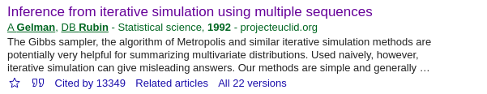
```
* Also cited influential papers

## Cited papers
::: columns
:::: column
```{r}


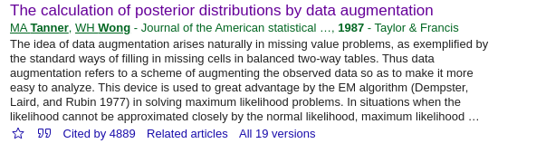
```
::::
:::: column
```{r, fig.align = "left"}
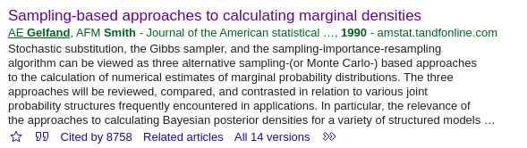
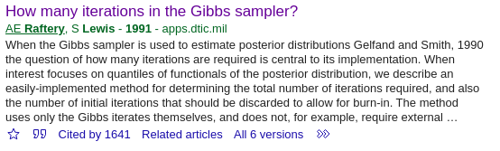
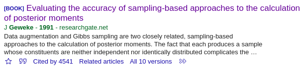
```
::::
:::

## Overview of $\hat{R}$
- For "iterative simulations"

- Didn't discuss particular methods as the following problems are separate:
  * Creating simulations
  * **Obtaining inferences from simulations**
- Useful diagnostic in assessing convergence
  * Routine in Stan, JAGS, WinBUGS, OpenBUGS, PyMC3, NIMBLE
  * `coda::gelman.diag()` in R

## Notation
- $M$ chains of $N$ draws

- $\theta$: scalar quantity of interest
- $\theta_{nm}$: $n$th draw of $m$th chain
  * $n=1,2,\ldots,N; \quad m=1,2,\ldots,M$
- $\bar{\theta}_{\cdot m}=\displaystyle\frac{1}{N}\sum_{n=1}^N\theta_{nm}; \qquad \bar{\theta}_{\cdot\cdot}=\displaystyle\frac{1}{M}\sum_{m=1}^M\bar{\theta}_{\cdot m}=\displaystyle\frac{1}{NM}\sum_{m=1}^M\sum_{n=1}^N\theta_{nm}$

## Steps of computing $\hat{R}$
1. `r colorise("Obtain $M$ starting values", "white")`

2. Run algorithm with $M$ starting points
    * With burn-in - first half of each chain of length $N$
3. Calculate $\hat{R}$ using the $M$ chains
    * Component-wise
    * Scalar estimand of interest
4. Monitor $\hat{R}$ until it's near 1 for all components

## Steps of computing $\hat{R}$
1. Obtain $M$ starting values

2. Run algorithm with $M$ starting points
    * With burn-in - first half of each chain of length $N$
3. Calculate $\hat{R}$ using the $M$ chains
    * Component-wise
    * Scalar estimand of interest
4. Monitor $\hat{R}$ until it's near 1 for all components

## Steps of computing $\hat{R}$
1. Obtain $M$ starting values

    i. Find $K$ modes using optimisation program / statistical method (EM)
	
	    - Multiple starting points required
		
    ii. Calculate second derivative (Hessian) matrix at modes
	iii. Approximate target distribution by a mixture of $K$ normals so (approximate & target) densities match at the modes
	iv. Sample-importance-resample $M$ values from the mixture of normals

## Steps of computing $\hat{R}$
3. Calculate $\hat{R}$ using the $M$ chains
    - Focus on the estimate $(\hat{\sigma}^2)$ of the variance $(\sigma^2)$ of the target
\begin{eqnarray*}
\frac{B}{N} &= \displaystyle\sum_{m=1}^M \frac{\left(\bar{\theta}_{\cdot m}-\bar{\theta}_{\cdot\cdot}\right)^2}{M-1}, \qquad
W &= \sum_{m=1}^M \frac{s_m^2}{M} \qquad\qquad\qquad\qquad\qquad\qquad\\
\hat{\sigma}^2 &= \displaystyle \frac{N-1}{N}W + \frac{1}{N}B, \qquad \hat{V} &= \hat{\sigma}^2+\frac{1}{NM}B \\
d &= \displaystyle\frac{2\hat{V}^2}{\widehat{\text{Var}}(\hat{V})}, \qquad\qquad\quad\hat{R}&=\sqrt{\frac{\hat{V}}{W}\times\frac{d+3}{d+1}}
\end{eqnarray*}

## Potential scale reduction factor
$$ \hat{R} = \displaystyle\sqrt{\frac{\hat{V}}{W}\times\frac{d+3}{d+1}}=\displaystyle\sqrt{\left(\frac{M+1}{M}\frac{\hat{\sigma}^2}{W}-\frac{N-1}{NM}\right)\times\frac{d+3}{d+1}};\qquad R= \displaystyle\sqrt{\frac{\hat{V}}{\sigma^2}} \qquad $$

* The former approximates the latter subject to sampling variability

  - $B/(NM)$ accounts for variability in the mean estimate
  - $(d+3)/(d+1)$ accounts for variability in the variance estimate

* Correction from $d/(d-2)$ by Brooks and Gelman (1998)
  - This is the version used by `coda::gelman.diag()`

## A simpler version
\begin{eqnarray*}
\frac{B}{N} &= \displaystyle\sum_{m=1}^M \frac{\left(\bar{\theta}_{\cdot m}-\bar{\theta}_{\cdot\cdot}\right)^2}{M-1}, \qquad
W &= \sum_{m=1}^M \frac{s_m^2}{M} \\
\hat{V} &= \displaystyle \frac{N-1}{N}W + \frac{1}{N}B, \qquad \hat{R}&=\sqrt{\frac{\hat{V}}{W}}
\end{eqnarray*}

* This is the version used by Vehtari et al. (2021) (and the version I learned)

* Brooks and Gelman (1998) argued that the correction is minor because at convergence $d$ tends to be large


## Practicalities
* $B$ will overestimate $\sigma^2$ if the chain is positively autocorrelated

  - Larger $\hat{R}$ than a chain with the same target but independent draws

* Mechanistic once the chains are obtained
* Can monitor online
* Splitting into half chains (Gelman et al., 2013)
  - To check good mixing **and** stationarity

## Back to the assumptions
* Based on assuming that the marginal posteriors are approximately normal

  - So the derived quantities will follow Student's $t$ with sampling variability
* If it's not close to 1, there is a problem
  - E.g. not converged to a multimodal target yet
* Could problems be masked if $\hat{R}$ is close to 1?

# Vehtari, Gelman, Simpson, Carpenter and B`r {"\u00fc"}`rkner (2021)

## Four scenarios
```{r, out.width = "75%"}
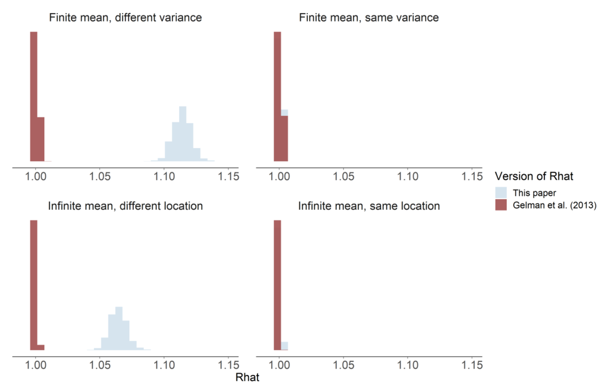
```

## Where traditional $\hat{R}$ fails
* ~~Targets with different (finite) mean~~

* Targets with same finite mean but different variances

* Targets with infinite mean and different location
* Little is said about convergence in the tails

## What about the Effective Sample Size (ESS)?
* The higher the ESS the better

* One version (Gelman et al., 2003) is based on $\hat{V}$
* For multimodal distributions with well-separated modes, the ESS estimate could be close to the number of distinct modes found
* ESS overestimated if computed from a single chain

## Proposed improvements
1. Compute $\hat{R}$ and ESS based on the **rank-normalised** sample

    - Well-defined even if chains do not have finite mean/variance

2. Calculate the same measures for the **folded** draws
3. **Localisation** of convergence diagnostics
4. New diagnostic tools

    - to visualise the convergence
    - more informative than standard trace plots

## Rank normalisation
* Previously: Use $\theta_{nm}$ to calculate $\hat{R}$ & ESS

* Now: Use $z_{nm}=\Upphi^{-1}\displaystyle\left(\frac{\text{rank}(\theta_{nm})-3/8}{NM-1/4}\right)$ in the formulae
  - It works because calculated is the rank among **all** $NM$ draws

Properties

* For continuous variables the normality assumptions are satisfied

* Practically the same results for nearly normally distributed variables
* Invariant to monotonic transformation

## Folding
* The rank normalised version could still be defeated by chains with

  - same location/mean but
  - different scales/variances

* Calculate $\zeta_{nm}=\left|\theta_{nm}-\text{median}(\theta)\right|$
* Use $z_{nm}=\Upphi^{-1}\displaystyle\left(\frac{\text{rank}(\zeta_{nm})-3/8}{NM-1/4}\right)$ instead of $\theta_{nm}$ in the formulae

## Localisation
* $\hat{R}$ & ESS indicative of overall efficiency

  - Efficiency of quantile estimates tends to be lower than for the mean/median

* Using rank normalisation, we can compute $\hat{R}$ & ESS for quantiles in a similar way to that for the mean
* Localised in terms of regions of the target, not regions of the chains

## Localisation: $\alpha$-quantile
1. Estimate $\theta_\alpha$ by the $\alpha$-quantile of the ECDF of the draws
  
2. Calculate $I\left(\theta_{nm}\leq\hat{\theta}_\alpha\right)$ - a matrix of $0$'s & $1$'s
3. Use $z_{nm}=\Upphi^{-1}\displaystyle\left(\frac{\text{rank}\left(I(\theta_{nm}\leq\hat{\theta}_\alpha)\right)-3/8}{NM-1/4}\right)$ instead of $\theta_{nm}$ in the formulae

## Localisation: $\alpha$-quantile
::: columns
:::: column
* Cauchy example
```{r}
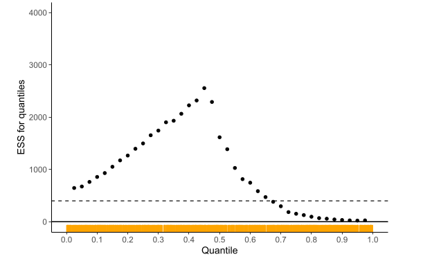
```
::::
:::: column
* Alternative parametrisation
```{r}
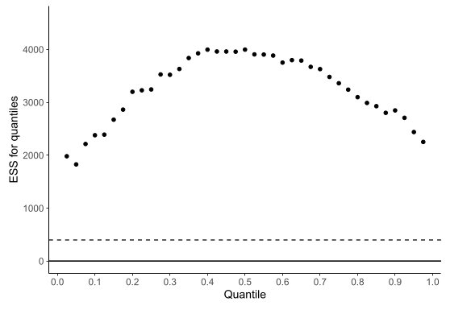
```
::::
:::

## Localisation: small intervals
1. Estimate $\theta_\alpha$ and $\theta_{\alpha+\delta}$

2. Calculate $I\left(\hat{\theta}_\alpha<\theta_{nm}\leq\hat{\theta}_{\alpha+\delta}\right)$
3. Use $z_{nm}=\Upphi^{-1}\displaystyle\left(\frac{\text{rank}\left(I(\hat{\theta}_\alpha<\theta_{nm}\leq\hat{\theta}_{\alpha+\delta})\right)-3/8}{NM-1/4}\right)$ instead of $\theta_{nm}$ in the formulae

## Localisation: small intervals
::: columns
:::: column
* Cauchy example
```{r}
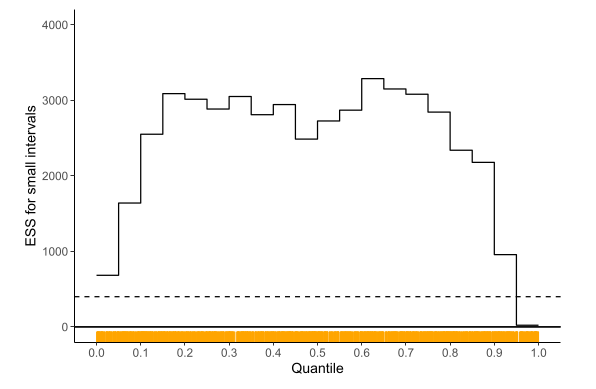
```
::::
:::: column
* Alternative parametrisation
```{r}
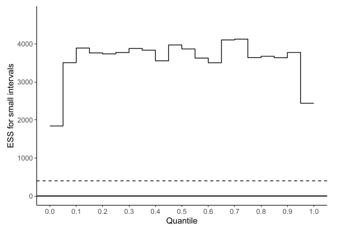
```
::::
:::

## Localisation: median absolute deviation
* Instead of standard error

1. Using $\zeta_{nm}=\left|\theta_{nm}-\text{median}(\theta)\right|$

2. Calculate $I\left(\zeta_{nm}\leq\text{median}(\zeta)\right)$ - a matrix of $0$'s & $1$'s
3. Use $v_{nm}=\Upphi^{-1}\displaystyle\left(\frac{\text{rank}\left(I(\zeta_{nm}\leq\text{median}(\zeta))\right)-3/8}{NM-1/4}\right)$ instead of $\theta_{nm}$ in the formulae

## Back to list of scenarios
* Targets with different (finite) mean $\leftarrow$ **Traditional** $\hat{R}$ $\checkmark$

* Targets with infinite mean and different location $\leftarrow$ **Rank normalisation** $\checkmark$
* Targets with same finite mean but different variances $\leftarrow$ **Folding** $\checkmark$
* Little is said about convergence in the tails $\leftarrow$ **Localisation** $\checkmark$

## Diagnostic visualisations
* In addition to the numerical convergence diagnostics

* Again built on ideas around rank, quantiles, and ESS
* We have seen the plots of ESS for small intervals and quantiles

## Rank plots
::: columns
:::: column
* Cauchy example
```{r}
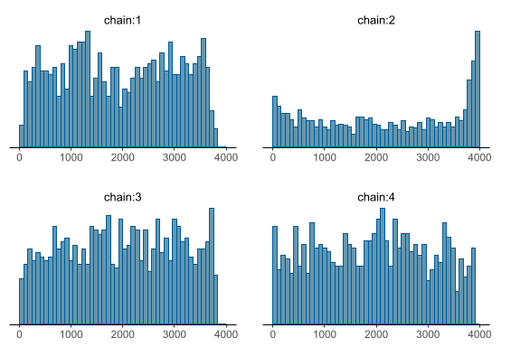
```
::::
:::: column
* Alternative parametrisation
```{r}
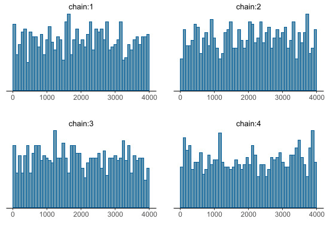
```
::::
:::

* Expected to look uniform if all chains target the same posterior

## Efficiency per iteration plots
```{r, out.width = "49%", fig.show = "hold"}
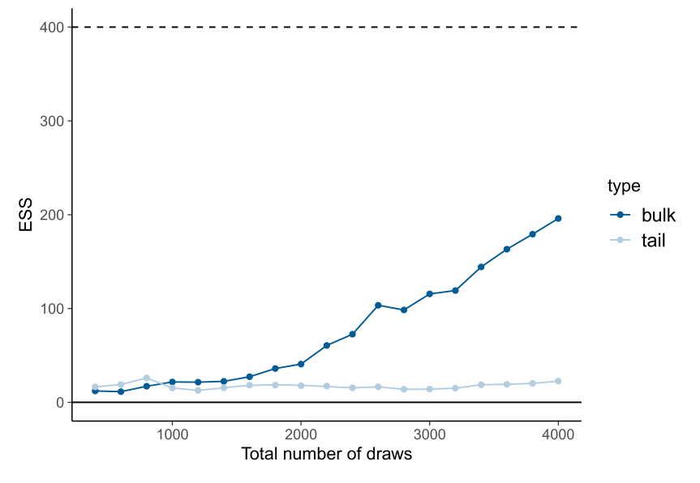
```
* To check if ESS grows sublinearly or even decreases with total number of draws $NM$

## Practical recommendations
* Run at least four chains by default

  - Followed by splitting into halves to calculate the above quantities
* Compute modified $\hat{R}$ & ESS using rank normalisation:

  - for the **mean**
  - $+$ folding for the **variance**
  - $+$ localisation for (tail) **quantiles** & **small intervals**
* Use the sample if:

  - Modified $\hat{R}<1.01$ - tighter than Gelman and Rubin (1992) recommended
  - Modified ESS $>400$
* Diagnostic visualisations using the computed quantities
* Modify the algorithm to speed up convergence

  - These diagnostics don't fix the issue automatically
  - Parametrise so that the posteriors are approximately normal or at least light-tailed
