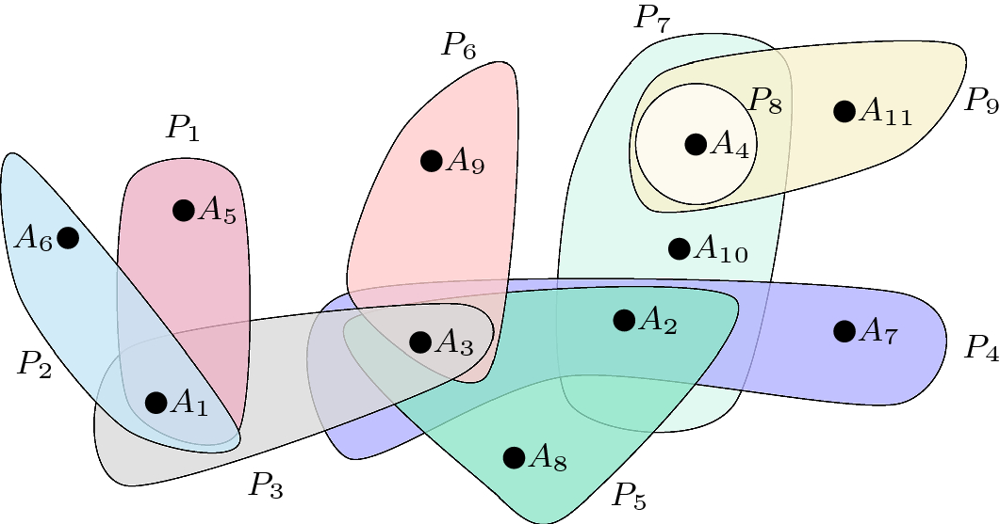

```{r prelim, include = FALSE, message = FALSE}
library(tidyverse)
library(crandep)
library(igraph)
knitr::opts_chunk$set(out.width = "95%", fig.align = "center", message = FALSE, fig.asp = 0.7, echo = FALSE)
ggplot2::theme_set(ggplot2::theme_bw(40))
```

## Supervisory team
* Clement Lee and Chris Nemeth (Lancaster)

* Brendan Murphy (UC Dublin)

## Random graph models
* For pairwise interactions between individuals

* Different models for various purposes
  - ERGM
  - Stochastic block model
  - Preferential attachment model
  - Latent space model
* Applications
  - Social networks
  - Biological: E. Coli
  - Brain: Connectome

## Hypergraph models
::: columns
:::: column
* For interactions involving more than two individuals

* Applications
  - Co-authorship networks
  - Referees in football/rugby matches
::::
:::: column
```{r, fig.cap = "Lung et al. (2018, Scientometrics)"}

```
::::
:::

## Idea 1: Hypergraph as a bipartite graph
* Not entirely new, but useful for subsequent steps

|  |$A_1$ |$A_2$ |$A_3$ |$A_4$ |...|
|:-|:-|:-|:-|:-|:-|
|$P_1$ |$\checkmark$  |  |  |  |...|
|$P_2$ |$\checkmark$  |  |  |  |...|
|$P_3$ |$\checkmark$  |  |$\checkmark$  |  |...|
|$P_4$ |  |  |$\checkmark$  |$\checkmark$  |...|
|$P_5$ |  |$\checkmark$  |$\checkmark$  |  |...|
|$P_6$ |  |  |$\checkmark$  |  |...|
|$\vdots$|$\vdots$ |$\vdots$ |$\vdots$ |$\vdots$ |$\ddots$ |

## Idea 2: Seemingly non-networks as networks
::: columns
:::: column
* Recommender systems

  - Godoy-Lorite et al. (2016, PNAS)
  - Individual 1 watched movies A & C
  - Individual 2 bought item B
  
* Topic modelling

  - Gerlach et al. (2018, Science Advances)
  - Paper 1 used words A & C
  - Paper 2 used word B
  
::::
:::: column
|  |A |B |C |D |...|
|:-|:-|:-|:-|:-|:-|
|1 |$\checkmark$  |  |$\checkmark$  |  |...|
|2 |  |$\checkmark$  |  |  |...|
|3 |$\checkmark$  |  |  |  |...|
|4 |  |  |$\checkmark$  |$\checkmark$  |...|
|5 |$\checkmark$  |$\checkmark$  |  |$\checkmark$  |...|
|6 |  |  |$\checkmark$  |  |...|
|$\vdots$|$\vdots$ |$\vdots$ |$\vdots$ |$\vdots$ |$\ddots$ |
::::
:::

## Why?
* Rapid developments over the last decade

  - Account for heterogeneity in the degrees
  - Efficient computational algorithms
<!--  - Various methods for inferring the number of groups -->

* Rich information in co-authorship networks
  1. Interactions between papers & authors
  2. Citations between papers
  3. Interactions between papers & text

## Goals
* A model that encompasses all information available

  - As three layers of network, or
  - As one single network

* Implementation of computational advances
  - Scalable algorithms

* Application to real data sets
  - Ji and Jin (2016, Annals of Applied Statistics)

