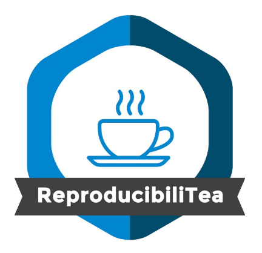
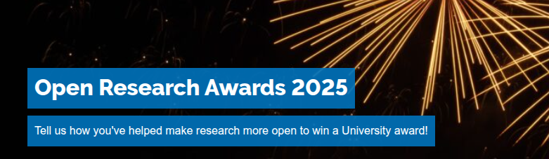
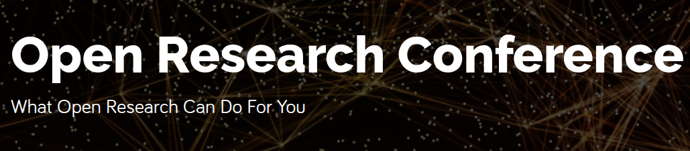
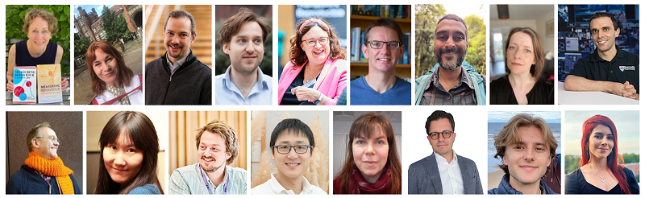

## Overview

* Introduction (15 min)
* Open Access Publishing (30 min)
* Q & A (15 min)
* Breakout discussions (45 min)
* Summary & next steps (15 min)
* Lunch (at TR4)

```{r setup}
#| echo: false
knitr::opts_chunk$set(echo = FALSE, out.width = "80%", dev.args = list(bg = "white"))
```

# Open research (OR)

## General principles

::: columns

:::: {.column width="55%"}

Accessible, transparent & reproducible; from inception to dissemination

* Study and design
* Methods and materials
* Data
* Code and software
* **Publication**

::::

:::: {.column width="45%"}

**Goals:**

Resulting in outputs with

* No restrictions on access
* Open licence to facilitate reuse
* Persistent identifier (DOI, citable)
* Standardised open metadata

::::

:::

## Why should research be (more) open?

* Wider / fairer access to research
* Accelerates discovery and innovation
* Facilitates collaboration over competition
* Improves rigour, reproducibility and transparency
* Increases public trust
* Funder / REF (PCE) mandates

## As open as possible, as closed as necessary

Balance benefits of sharing with privacy, ethical & regulartory requirements

* Sensitive data
* Privacy of participants (consent)
* Protection of human participants, plant/animal species, historical sites
* Commercial restrictions or concerns
* National security

# OR at Newcastle University

## Library Research Services

Open Research Officers:

* Steve Boneham (Training and Development)
* Heather McKenna (Open Access)
* Bogdan Metes (Research Data, data.ncl.ac.uk)

## Training

* Preregistration 
* Computational Reproducibility
* Qualitative Research
* Open Data
* ......

Find out more:

* PGRs: through PGRDP
* RAs & academics: elements.ncl.ac.uk

## Practice sharing

::: columns

:::: {.column width="50%"}

$$~~$$

* Monthly journal club

* Informal discussion

* https://bit.ly/ncl-repro

::::

:::: {.column width="50%"}

```{r tea}
#| fig.align: "left"

```
$$~~$$

::::

:::

##

```{r ora}
#| out.width: "60%"

```

```{r conference}
#| out.width: "60%"

```

* Look out for this year's conference and awards

## Champions

<!-- A community of champions helping to promote and support a more open research culture -->

```{r champions}
#| out.width: "60%"
#| fig.align: "center"

```

Within MSP:

* Tiago Mesquita Santos Verissimo (Pure Mathematics)
* Chris Harrison (Physics)
* Me (Statistics & Data Science)

## Tailor-made workshops

* Need for unit-specific training
* MSP one of the pioneering schools 
* Let us know your ideas