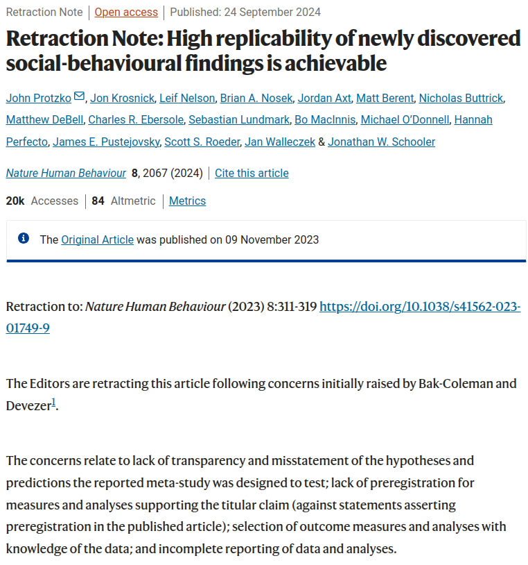
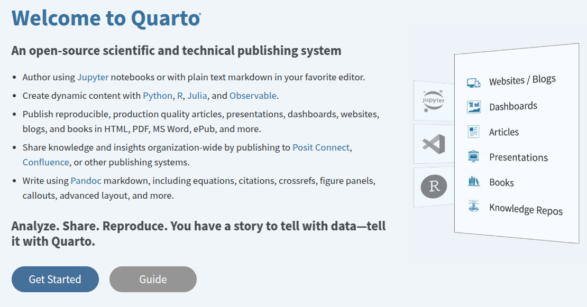
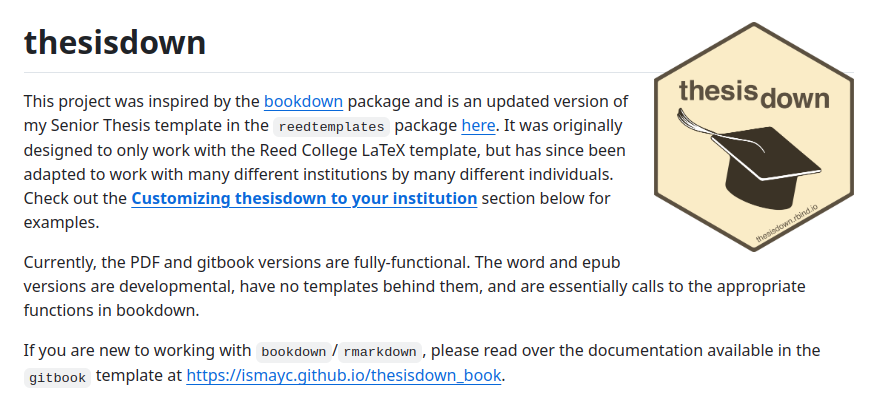
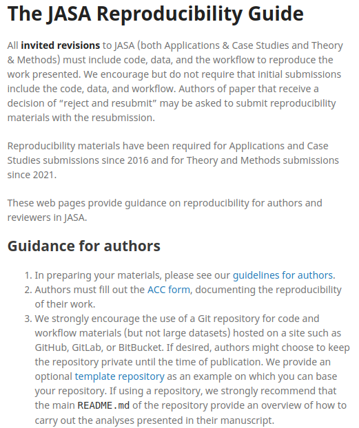

## House rules

* Help yourselves with the refreshments

* Not aware of fire alarm testing

* Ask questions at any point

## Outline

:::::: {.columns}
::: {.column width="49%" data-latex="{\textwidth}"}

1. Introduction, RStudio

2. Reproducible documents with R Markdown

3. Practical

4. Advanced stuff

:::
::: {.column width="2%" data-latex="{\textwidth}"}
\ 
<!-- an empty Div (with a white space), serving as
a column separator -->
:::
::: {.column width="49%" data-latex="{\textwidth}"}

* Today's slides: https://bit.ly/ukrn-comp-repro

* Further training:  
  https://bit.ly/literate-programming

* Converting from LaTeX:  
  https://bit.ly/bookdown2024

:::
::::::

<!-- Running this for the first time, feel free to interrupt and ask questions -->

## Why coding?

- Future-proof your analysis

  * for others to reproduce

  * including **your future self**

- ChatGPT & others making it easier to start

- Also the stepping stone for machine learning and AI

  * but don't start with something completely unfamiliar

  * garbage in, garbage out

- Version control, CI/CD, and beyond

## What tools do you use?

:::::: {.columns}
::: {.column width="49%" data-latex="{\textwidth}"}


- Statistical analysis: Python, MS Excel?

- Writing presentations: MS Powerpoint?

- Writing papers: MS Word, Overleaf?

:::
::: {.column width="2%" data-latex="{\textwidth}"}
\ 
<!-- an empty Div (with a white space), serving as
a column separator -->
:::
::: {.column width="49%" data-latex="{\textwidth}"}

:::
::::::

<!-- For me to get an understanding -->

## We can do all in one unified approach (in R)

:::::: {.columns}
::: {.column width="49%" data-latex="{\textwidth}"}

- ~~Statistical analysis: Python, MS Excel?~~

- ~~Writing presentations: MS Powerpoint?~~

- ~~Writing papers: MS Word, Overleaf?~~

:::
::: {.column width="2%" data-latex="{\textwidth}"}
\ 
<!-- an empty Div (with a white space), serving as
a column separator -->
:::
::: {.column width="49%" data-latex="{\textwidth}"}

* There are some caveats

* Showing you what's possible

* Particularly useful if you have a lot of numbers / tables / figures from your analysis

:::
::::::

## Scope

:::::: {.columns}
::: {.column width="49%" data-latex="{\textwidth}"}

* Can others run your code and get identical results?

* Can reproducibility be done in an efficient manner?

:::
::: {.column width="2%" data-latex="{\textwidth}"}
\ 
<!-- an empty Div (with a white space), serving as
a column separator -->
:::
::: {.column width="49%" data-latex="{\textwidth}"}

**Not covered**

* Can others perform the same (non-computational) experiment themselves, and reach the same conclusion with broadly the same results?

* Is my hypothesis valid? Are my methods / models useful?

* Python

:::
::::::

<!-- It doesn't seem much, but there is a lot that we can do, as you will see -->

## Why not Python?

- Python great for big data pipelines

  * Interfacing with the web
  * Machine learning at scale

- R is better in some other aspects

  * Standalone analysis
  * The whole data pipeline with `tidyverse`
  * The notebook / literate programming approach

- Understand which one is better / more suited for your tasks

## R

- Free & open source

- Download from https://cran.r-project.org/

- Anyone can contribute:

  * https://cran.r-project.org/web/packages/available_packages_by_name.html

## RStudio

- The best interface for using R

- Download from https://posit.co/download/rstudio-desktop/

- Readily available on a university computer

- Let's have a look

<!-- give a quick tour of R -->

## So far so good?

## The case for computational reproducibility

:::::: {.columns}
::: {.column width="49%" data-latex="{\textwidth}"}

```{r setup}
#| echo: false
knitr::opts_chunk$set(echo = FALSE, fig.align = "center")
```

```{r gene}
#| fig.cap: "https://www.theverge.com/2020/8/6/21355674"
knitr::include_graphics("https://platform.theverge.com/wp-content/uploads/sites/2/chorus/uploads/chorus_asset/file/21700662/excel_gene_names_111.gif")
```

* Coding is only the first step

* Reproducibility not guaranteed in the whole process

:::
::: {.column width="2%" data-latex="{\textwidth}"}
\ 
<!-- an empty Div (with a white space), serving as
a column separator -->
:::
::: {.column width="49%" data-latex="{\textwidth}"}

```{r retraction}
#| fig.cap: "https://doi.org/10.1038/s41562-024-01997-3"

```

:::
::::::

<!-- Keeping all the scripts is not necessarily the most efficient way -->

## The old-school way

* Write some scripts with all the code for your analysis

* Save the required plots as some image files

* Save the numbers / tables as screenshots, or copy the numbers manually to MS Word / Overleaf

* Edit the text and generate the **output** (slides, paper, webpage)

## What if your analysis or data changes?

* Edit the code in the scripts on your computer

* Update the results (plots, numbers, tables) in the plain text files

* Repeat if needed

* Sooner or later: likely mismatch between reported results and those from running the scripts 

## Another scenario

:::::: {.columns}
::: {.column width="49%" data-latex="{\textwidth}"}

* Wanting to revert to previous version of the analysis, but the scripts have already been updated

* Save a new set of scripts every time

* Eventually it becomes difficult to find the right version again

* Autosave & track changes help, but still not perfect

:::
::: {.column width="2%" data-latex="{\textwidth}"}
\ 
<!-- an empty Div (with a white space), serving as
a column separator -->
:::
::: {.column width="49%" data-latex="{\textwidth}"}

```{r document}
#| out.width: "50%"
#| fig.cap: "https://xkcd.com/1459/"
knitr::include_graphics("https://imgs.xkcd.com/comics/documents.png")
```

:::
::::::

## Side track: Literate programming

* I shall pass around the two books

* Imagine how painstaking it was to copy all the code, results and plots to the text editor software

* What if the code could be run automatically, the results generated **on the fly**?

## Enter R Markdown

* Just R + Markdown

* Markdown similar to LaTeX

  - For creating formatted text using a plain-text editor
  - Learning curve less steep
  - Not main focus today; just type normal text if unsure

* After writing the script, some commands / button clicks create a pdf

  - There's more to that from R Markdown

## Installation

* Comes with RStudio

* Need a bit more within RStudio in order to get pdf to work

  - We can go through that if there's time

* Let's see how it works

## Chunk options

* What if I don't want to show the code?

* Is it possible to embed figure captions?

## Originally
:::::: {.columns}
::: {.column width="38%" data-latex="{\textwidth}"}
The script (.Rmd)
````{verbatim, lang = "markdown", echo = TRUE}
```{r}


plot(cars)
```
The figure above shows the distance
against speed in the cars data set.
````
:::
::: {.column width="4%" data-latex="{\textwidth}"}
\ 
<!-- an empty Div (with a white space), serving as
a column separator -->
:::
::: {.column width="58%" data-latex="{\textwidth}"}
The output (.pdf / .html)
```{r}
#| echo: TRUE
plot(cars)
```
The figure above shows the distance
against speed in the cars data set.

:::
::::::

## Hide the code
:::::: {.columns}
::: {.column width="38%" data-latex="{\textwidth}"}
The script (.Rmd)
````{verbatim, lang = "markdown", echo = TRUE}
```{r}
#| echo: FALSE

plot(cars)
```
The figure above shows the distance
against speed in the cars data set.
````
:::
::: {.column width="4%" data-latex="{\textwidth}"}
\ 
<!-- an empty Div (with a white space), serving as
a column separator -->
:::
::: {.column width="58%" data-latex="{\textwidth}"}
The output (.pdf / .html)
```{r}
#| echo: FALSE
plot(cars)
```
The figure above shows the distance
against speed in the cars data set.

:::
::::::

## Make the plot smaller
:::::: {.columns}
::: {.column width="38%" data-latex="{\textwidth}"}
The script (.Rmd)
````{verbatim, lang = "markdown", echo = TRUE}
```{r}
#| echo: FALSE
#| out.width: "70%"
plot(cars)
```
The figure above shows the distance
against speed in the cars data set.
````
:::
::: {.column width="4%" data-latex="{\textwidth}"}
\ 
<!-- an empty Div (with a white space), serving as
a column separator -->
:::
::: {.column width="58%" data-latex="{\textwidth}"}
The output (.pdf / .html)
```{r}
#| echo: FALSE
#| out.width: "70%"
plot(cars)
```
The figure above shows the distance
against speed in the cars data set.

:::
::::::

## Proper figure caption
:::::: {.columns}
::: {.column width="38%" data-latex="{\textwidth}"}
The script (.Rmd)
````{verbatim, lang = "markdown", echo = TRUE}
```{r}
#| echo: FALSE
#| fig.cap: "Distance against speed in cars data set."
plot(cars)
```
````
:::
::: {.column width="4%" data-latex="{\textwidth}"}
\ 
<!-- an empty Div (with a white space), serving as
a column separator -->
:::
::: {.column width="58%" data-latex="{\textwidth}"}
The output (.pdf / .html)
```{r}
#| echo: FALSE
#| fig.cap: "Distance against speed in cars data set."
plot(cars)
```

:::
::::::

## Don't evaluate the code
:::::: {.columns}
::: {.column width="38%" data-latex="{\textwidth}"}
The script (.Rmd)
````{verbatim, lang = "markdown", echo = TRUE}
```{r}
#| eval: FALSE

plot(cars)
```
````
Also useful when showing code that doesn't work
:::
::: {.column width="4%" data-latex="{\textwidth}"}
\ 
<!-- an empty Div (with a white space), serving as
a column separator -->
:::
::: {.column width="58%" data-latex="{\textwidth}"}
The output (.pdf / .html)
```{r}
#| eval: FALSE
#| echo: true
plot(cars)
```

:::
::::::

## Hide the plots (but still evaluate)
:::::: {.columns}
::: {.column width="38%" data-latex="{\textwidth}"}
The script (.Rmd)
````{verbatim, lang = "markdown", echo = TRUE}
```{r}
#| fig.show: "hide"

plot(cars)
```
````
:::
::: {.column width="4%" data-latex="{\textwidth}"}
\ 
<!-- an empty Div (with a white space), serving as
a column separator -->
:::
::: {.column width="58%" data-latex="{\textwidth}"}
The output (.pdf / .html)
```{r}
#| fig.show: "hide"
#| echo: true
plot(cars)
```

:::
::::::

## Hide the code & results (but still evaluate)
:::::: {.columns}
::: {.column width="38%" data-latex="{\textwidth}"}
The script (.Rmd)
````{verbatim, lang = "markdown", echo = TRUE}
```{r}
#| include: FALSE

plot(cars)
```
````
:::
::: {.column width="4%" data-latex="{\textwidth}"}
\ 
<!-- an empty Div (with a white space), serving as
a column separator -->
:::
::: {.column width="58%" data-latex="{\textwidth}"}
The output (.pdf / .html)
```{r}
#| include: FALSE
#| echo: true
plot(cars)
```

:::
::::::

## More chunk options

* Caching

* Code decoration

* Side-by-side plots

* ...

* Full list here: https://yihui.org/knitr/options/

## "But I use LaTeX ..."

* Output in multiple formats

  - Separate the format from the content
  - Same content, multiple outputs with (almost) no changes
  - Full list here: https://rmarkdown.rstudio.com/formats.html
  - Will mention more later

* Not all is lost

````{verbatim, lang = "latex", echo = TRUE}
$$ \frac{\pi}{4} = 1-\frac{1}{3}+\frac{1}{5}-\frac{1}{7} + \cdots = \sum_{k=0}^{\infty}\frac{(-1)^k}{2k+1} $$
````

$$ \frac{\pi}{4} = 1-\frac{1}{3}+\frac{1}{5}-\frac{1}{7} + \cdots = \sum_{k=0}^{\infty}\frac{(-1)^k}{2k+1} $$

* Conversion from a clunky language (LaTeX) to a light-weight one (Markdown)

* Presentation on conversion: https://bit.ly/bookdown2024

## "But I use other languages ..."

* Supports Python, SQL, Julia, etc.

* [{reticulate} package](https://cran.r-project.org/package=reticulate) for Python

:::::: {.columns}
::: {.column width="48%" data-latex="{\textwidth}"}
The script (.Rmd)
````{verbatim, lang = "markdown", echo = TRUE}
```{python}
import math
round(2 * math.pi, 4)
```
````
:::
::: {.column width="4%" data-latex="{\textwidth}"}
\ 
<!-- an empty Div (with a white space), serving as
a column separator -->
:::
::: {.column width="48%" data-latex="{\textwidth}"}
The output (.pdf / .html)
```{python, include = TRUE}
import math
round(2 * math.pi, 4)
```
:::
::::::

## Other features (if there's time)

* $\checkmark$ Inline code ($\rightarrow$ no need to hard-code results)

* $\checkmark$ External figures (locally or on the web)

* $\checkmark$ Tables

* $\checkmark$ Referencing figures & tables

* $\checkmark$ Citations via BibTeX

* $\checkmark$ Use LaTeX packages

* $\checkmark$ Resolving LaTeX issues within RStudio

## Your turn -- Practical

:::::: {.columns}
::: {.column width="49%" data-latex="{\textwidth}"}

**Goals**

* Think about which part of your analysis can be made reproducible

* Convert an existing script, or create a new analysis

* Generate the output in multiple format

:::
::: {.column width="2%" data-latex="{\textwidth}"}
\ 
<!-- an empty Div (with a white space), serving as
a column separator -->
:::
::: {.column width="49%" data-latex="{\textwidth}"}

**Troubleshooting**

* No laptop? Use a university computer

* Don't know R? Some notes to get you started

* No data? Consider the following:

  - `mtcars` (a built-in data set)
  - https://data.ncl.ac.uk/

* Excel spreadsheet (.xlsx, .xls)?

  ```{r readxl}
  #| echo: true
  #| eval: false
  # do this once only
  install.packages("readxl")

  # do the following every time
  library(readxl)
  mydata <- read_xlsx("<filename>.xlsx")
  ```  

:::
::::::

## Advanced 1: Quarto

* https://quarto.org/

* Language agnostic

* Compatible with R Markdown

```{r quarto}
#| out.width: "50%"

```

## Advanced 2: Bookdown -- R Markdown upgrade

:::::: {.columns}
::: {.column width="44%" data-latex="{\textwidth}"}
A collection of .Rmd files

* index.Rmd
* 01-multivariate-data.Rmd
* 02-pca.Rmd
* 03-cluster.Rmd
* 04-regression.Rmd
* 05-regularisation.Rmd
* 06-classification.Rmd
* 07-matrix.Rmd
* 08-factorisation.Rmd
* 09-references.Rmd
:::
::: {.column width="4%" data-latex="{\textwidth}"}
\ 
<!-- an empty Div (with a white space), serving as
a column separator -->
:::
::: {.column width="52%" data-latex="{\textwidth}"}
index.Rmd
````{verbatim, lang = "markdown", echo = TRUE}
---
title: "MAS8383 Statistical Learning Methodology"
author: "Clement Lee"
date: Semester 1, 2023/2024  
output: bookdown::gitbook
documentclass: book
papersize: a4
geometry:
- margin=1in
fontsize: 12pt
bibliography: [references.bib]
biblio-style: apalike
link-citations: yes
---
````

```{r, eval = FALSE, echo = TRUE}
library(bookdown)
render_book("index.Rmd", 
            output_format = c("bookdown::gitbook", "bookdown::pdf_book"))
```
:::
::::::

## Advanced 2.5: Writing a whole thesis!

Some blog posts / guides

* https://tysonbarrett.com/jekyll/update/2018/02/11/r_dissertation/

* https://cran.r-project.org/web/packages/iheiddown/vignettes/thesis.html

* https://ourcodingclub.github.io/tutorials/rmarkdown-dissertation/

:::::: {.columns}
::: {.column width="44%" data-latex="{\textwidth}"}

An ongoing project

* https://github.com/ismayc/thesisdown

* Templates for different institutions

* Not yet for Newcastle University

:::
::: {.column width="4%" data-latex="{\textwidth}"}
\ 
<!-- an empty Div (with a white space), serving as
a column separator -->
:::
::: {.column width="52%" data-latex="{\textwidth}"}

```{r thesisdown}
#| out.width: "80%"
#| fig.align: "left"

```

:::
::::::

## Advanced 3: Writing journal articles!

* [{rticles} package](https://cran.r-project.org/package=rticles) provides templates -- again, **you** can contribute

* Examples at https://pkgs.rstudio.com/rticles/articles/examples.html 

* There might be more issues as the output is usually pdf

* Let's see how it works

```{r rticles}
#| echo: true
#| eval: false
# Run this once
install.packages("rticles")
```

## Reproducibility check

:::::: {.columns}
::: {.column width="54%" data-latex="{\textwidth}"}

* What if a journal has reproducibility requirements?

  - Just give them the Rmd (and data)!

* No need to give multiple scripts with convoluted instructions

* Related question: Can somebody reproduce your results **on their computer**?

  - Absolute paths vs relative paths
  - Package dependencies, environments

* Scope for pre-submission checks within the university?

:::
::: {.column width="2%" data-latex="{\textwidth}"}
\ 
<!-- an empty Div (with a white space), serving as
a column separator -->
:::
::: {.column width="44%" data-latex="{\textwidth}"}

```{r jasa-repro-guide}
#| out.width: "80%"
#| fig.align: "left"
#| fig.cap: "https://jasa-acs.github.io/repro-guide/"

```

:::
::::::

## Summary 1 -- scaffolding

:::::: {.columns}
::: {.column width="49%" data-latex="{\textwidth}"}

* Standalone outputs via R Markdown

  - R Markdown comes with RStudio

* Thesis / lecture notes

  - R package [{bookdown}](https://cran.r-project.org/package=bookdown) (all lowercase)
  - [thesisdown](https://github.com/ismayc/thesisdown) for templates

* Journal articles templates

  - R package [{rticles}](https://cran.r-project.org/package=rticles)

* Python content within

  - R package [{reticulate}](https://cran.r-project.org/package=reticulate)
  - Python itself

* Standalone output via Quarto

  - R package [{quarto}](https://cran.r-project.org/package=quarto)
  
:::
::: {.column width="2%" data-latex="{\textwidth}"}
\ 
<!-- an empty Div (with a white space), serving as
a column separator -->
:::
::: {.column width="49%" data-latex="{\textwidth}"}

* LaTeX & packages required for pdf outputs

  - Installation outside R, or
  - R package [{tinytex}](https://cran.r-project.org/package=tinytex)

  ```{r tinytex}
  #| eval: false
  #| echo: true
  # Run once
  install.packages("tinytex")
  library(tinytex)
  install_tinytex() # installs LaTeX (within R!)
  tlmgr_install() # installs LaTeX packages
  ```

:::
::::::

## Summary 2 -- practical tips

:::::: {.columns}
::: {.column width="54%" data-latex="{\textwidth}"}

* First generate the output without altering the template

* Can the output be generated and results updated if the data / analysis changes?

  - Don't hard-code results (it beats the point!)
  - https://bookdown.org/yihui/rmarkdown-cookbook/r-code.html

* Can the output be generated on someone's else computer?

  - Don't include commands like `install.packages()`
  - Don't use absolute paths (see right)

* Don't include interactive commands e.g. `View()`

* pdf issues can usually be solved with the use of the [{tinytex}](https://cran.r-project.org/package=tinytex) package

:::
::: {.column width="2%" data-latex="{\textwidth}"}
\ 
<!-- an empty Div (with a white space), serving as
a column separator -->
:::
::: {.column width="44%" data-latex="{\textwidth}"}

```{r fire1}
#| echo: FALSE
url <- "https://pbs.twimg.com/media/DQugFIWUEAErq0D?format=jpg"
```

<center>

<figcaption>
https://bit.ly/setwd
</figcaption>
</center>

<!--  -->

:::
::::::

## Summary 3 -- bigger picture

:::::: {.columns}
::: {.column width="49%" data-latex="{\textwidth}"}

Cons

* Initial cost (time) to convert $\qquad\rightarrow$

* Not as flexible as LaTeX $\qquad\rightarrow$

* Collaboration trickier $\qquad\rightarrow$

:::
::: {.column width="2%" data-latex="{\textwidth}"}
\ 
<!-- an empty Div (with a white space), serving as
a column separator -->
:::
::: {.column width="49%" data-latex="{\textwidth}"}

Pros

* The cost to switch increases over time

* Sufficiently developed over the years

* Possible with RStudio cloud

  - https://posit.co/blog/real-time-collaborative-editing-on-rstudio-cloud/

* Or through version control

:::
::::::

## Lastly

:::::: {.columns}
::: {.column width="49%" data-latex="{\textwidth}"}

* Coding is the first step of computational reproducibility

* Computational reproducibility is the first step of:

  - Open research
  - Useful analysis / method / model

* If you find it useful, spread the word & let us know!

:::
::: {.column width="2%" data-latex="{\textwidth}"}
\ 
<!-- an empty Div (with a white space), serving as
a column separator -->
:::
::: {.column width="49%" data-latex="{\textwidth}"}

* Email: clement.lee@newcastle.ac.uk

* I will send the link to the slides (or the Rmd?)

* Questions?

:::
::::::

```{r pipeline}
#| out.width: "50%"
#| fig.cap: "https://xkcd.com/2054/"
knitr::include_graphics("https://imgs.xkcd.com/comics/data_pipeline.png")
```
