```{r preamble, echo = FALSE}
library(knitr)
opts_chunk$set(echo = FALSE, fig.align = "center")
```

## Some weak chess engines
```{r gms, out.width = "48%", fig.show = "hold", fig.cap = "Source: Wikipedia"}
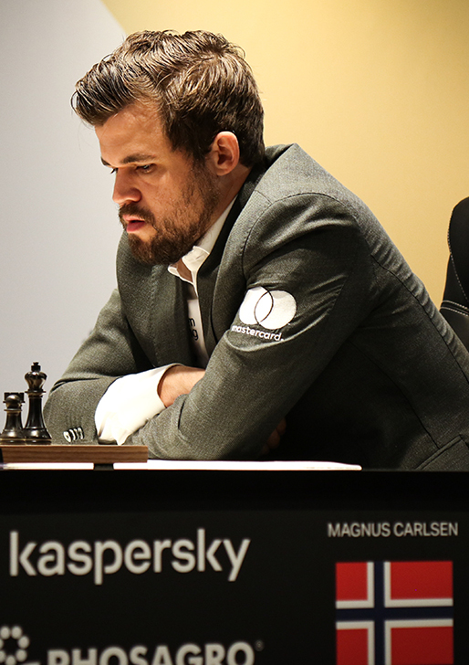
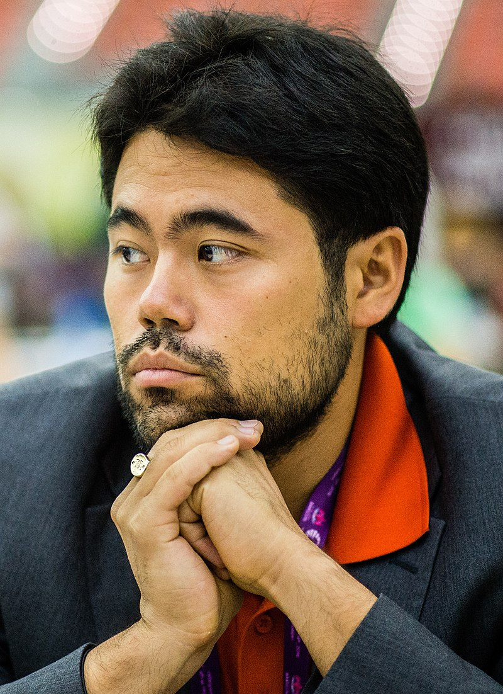
```

##
```{r murphy, out.width = "98%"}
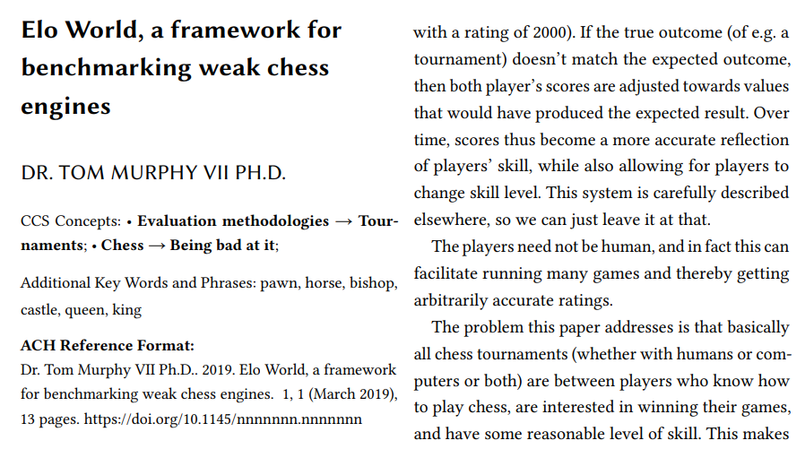
```

Tom Murphy VII, *Elo world, a framework for benchmarking weak chess engines*, A Record of the Proceedings of SIGBOVIK, 2019.

## Motivation
* Modelling performance of chess grandmasters

* Detecting cheating, online or over the board

```{r news, out.width = "98%", fig.cap = "https://www.bbc.co.uk/news/world-63010107"}
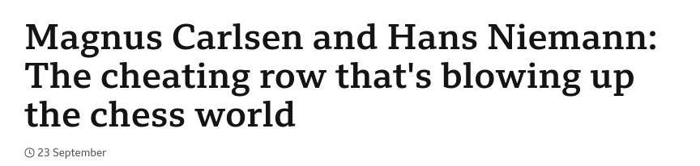
```

## Outline
1. Some basics

2. Modelling performance by outcome
    * $+$ collusion detection

3. Modelling performance by moves
    * $+$ cheating detection


# Some basics

## A standard board
```{r standard-board, out.width = "68%", fig.cap = "Source: https://www.chess.com/"}
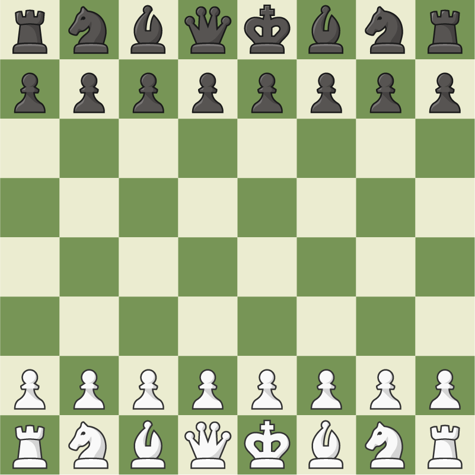
```

## How the pieces move
```{r how-move, fig.cap = "Source: https://www.dummies.com/", out.width = "90%"}
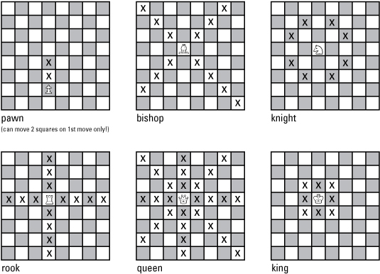
```

## Draws can happen
```{r draw, fig.cap = "Source: https://support.chess.com/", out.width = "98%"}
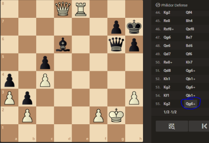
```

## Most common result in high level games
```{r chess-notation, fig.cap = "https://xkcd.com/1800/", out.width = "35%"}
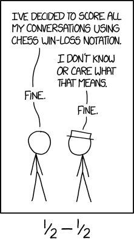
```

## Draw percentage might have gone up
```{r more-draws-yes, fig.cap = "https://www.chess.com/article/view/the-draw-rule-is-classical-chess-dead", out.width = "98%", fig.show = "hold"}
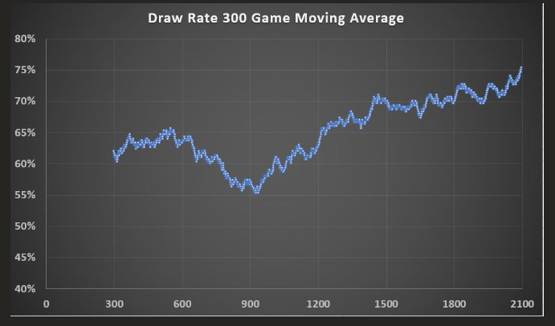
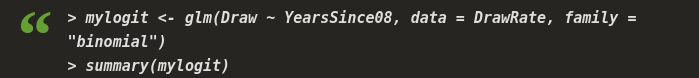
```

## Another says probably not
```{r more-draws-no, fig.cap = "https://en.chessbase.com/post/has-the-number-of-draws-in-chess-increased", out.width = "98%"}
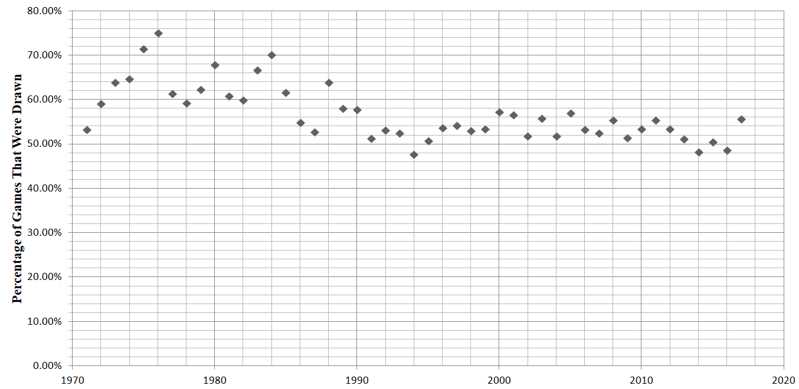
```

## Some observations
* Quick comparison:

  - The one says yes: Elo 2750+
  - The one says no: Elo 2600+
  - (One requirement for becoming a GM: Elo 2500+)

* Some recent tournaments reward taking risks

  - 3 points for win, 1 point for draw
  - More points for winning outright instead of winning in tiebreaks

* Super GMs prepare more thoroughly

  - More averse to taking risks, which increase the chance of a decisive result either way
  - With the help of computer engines

## Computer engines
```{r engines, out.width = "98%"}
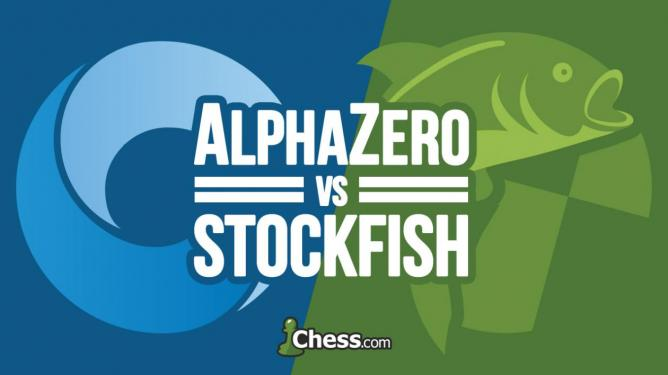
```

## Before computer engines
```{r endgame-tablebase, out.width = "98%", fig.cap = "https://en.wikipedia.org/wiki/Endgame\\_tablebase"}
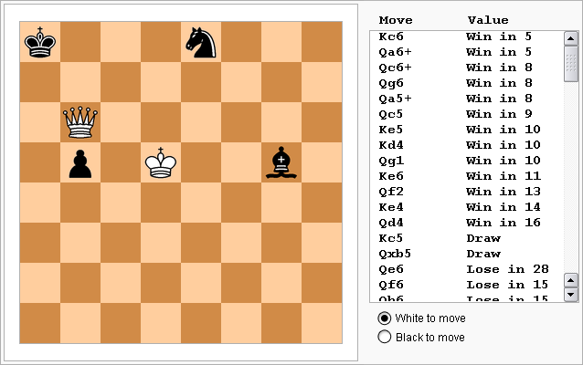
```

## There is no 32-piece tablebase (yet)
```{r game-ais, out.width = "48%", fig.cap = "https://xkcd.com/1002/ (cropped)"}
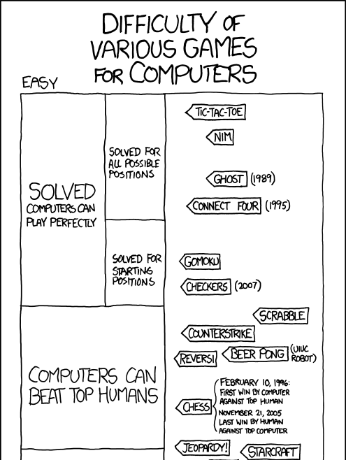
```

## Human chess is not dead because
* Chess is not completely solved

* Weak chess engines make mistakes (esp. under time pressure)

```{r game6, out.width = "58%", fig.cap = "Move 130, Game 6, FIDE World Chess Championship 2021"}
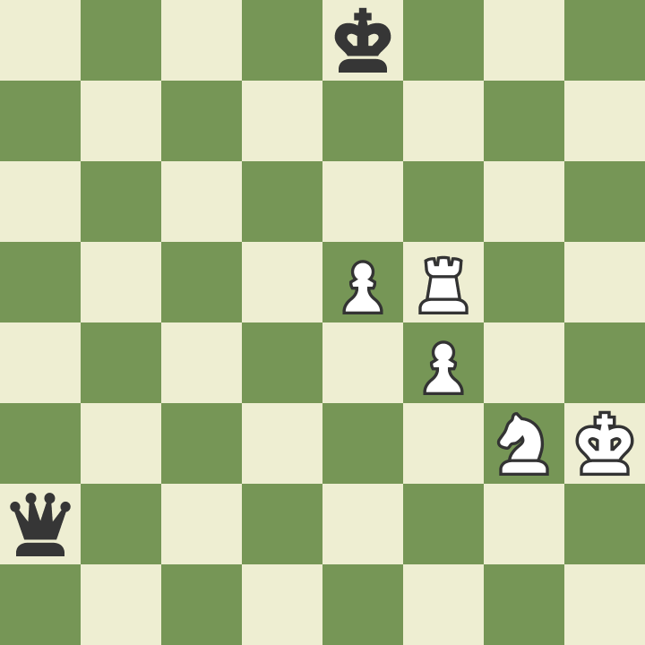
```

## So how do computer engines work?
* Evaluate the *position*

* Assign a value $\approx$ the number of (unpassed) pawns

```{r position, out.width = "98%", fig.cap = "A positive value here means white is better"}
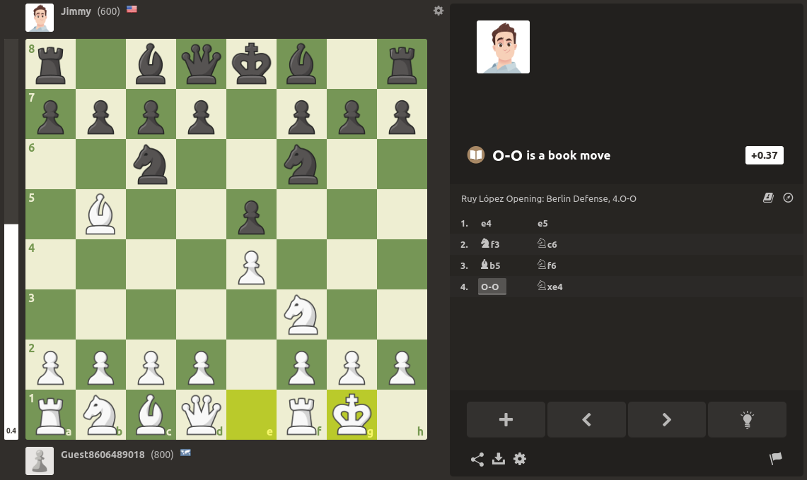
```

## Advantage over the moves
```{r game6-evaluation, out.width = "100%", fig.cap = "Source: https://fivethirtyeight.com"}
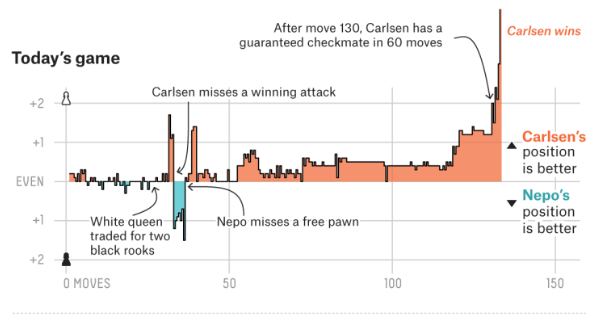
```


# $\qquad$Modelling the performance by outcome$\qquad$ and collusion detection

## Another xkcd picture
```{r dominant-players-1, out.width = "86%", fig.cap = "https://xkcd.com/1392/"}
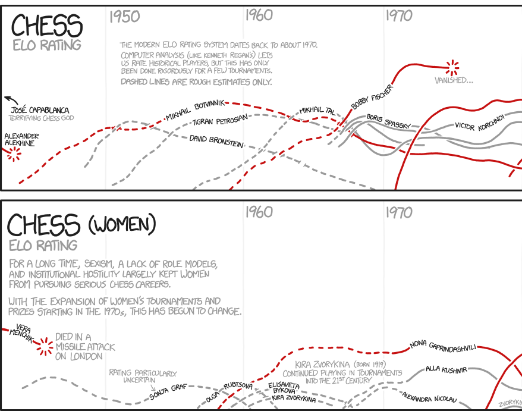
```

## Inflation or getting stronger?
```{r dominant-players-2, out.width = "80%", fig.cap = "https://xkcd.com/1392/"}
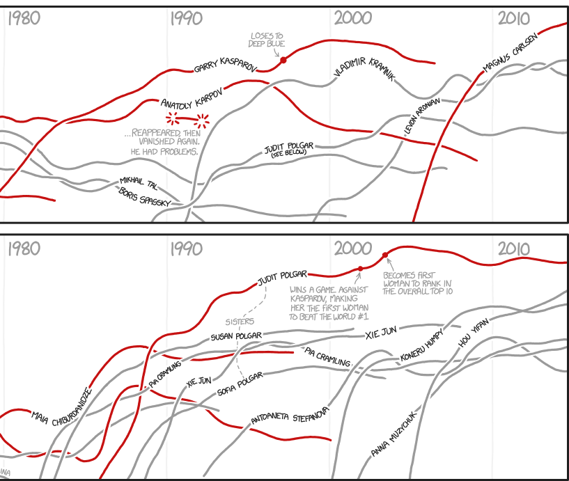
```

## @kd89
* Book: *Warriors of the Mind*

* Data: games between only 64 of the greatest players

* Bradley-Terry model
  - a draw counts half of a win

## @henery92
* Criticises @kd89
  - of the use of selective data
  - of the treatment of draws

* Noted systematic increase in the proportion of draws

* Thurstone-Mosteller model
  - Allows differing draw proportions of the players

* Suggests other potentially important factors

  - The length of game (number of moves)
  - Age of the players

## @cd12
* Bradley-Terry Model
  - Also allows ties

* Focus on the efficient Gibbs sampler upon data augmentation

* No ranking results presented
  - Only plots of ACF and test set RMSE

## Trying to unify the models
* The variables

  - $Y_i$: performance of $i$-th player
  - $X=Y_i-Y_j$

* The parameters

  - For $Y_i$: $\lambda_i>0$, or equivalently $\mu_i=\log\lambda_i$
  - Draw thresholds: $\delta_{ij}\geq0, ~\delta_{ji}=-\delta_{ij}$
  - $\sigma$ additionally for Thurstone-Mosteller

* Scenarios

  - $i\text{ beats }j\quad\Leftrightarrow\quad{}X>\delta_{ij}$
  - $i\text{ draws }j\quad\Leftrightarrow\quad{}\delta_{ji}<X<\delta_{ij}$ 
  
* When $\delta_{ij}=\delta_{ji}=0$, no draws

## If $Y_i$ is normally distributed with mean $\mu_i$
$$ \begin{aligned}
X&\sim\text{N}(\mu_i-\mu_j,\sigma)\\
\Pr(i\text{ beats }j)&=\Pr(X>\delta_{ij})\\
&=\Pr\left(\frac{X-(\mu_i-\mu_j)}{\sigma}>\frac{\delta_{ij}-(\mu_i-\mu_j)}{\sigma}\right)\\
&=\Pr\left(\frac{X-(\mu_i-\mu_j)}{\sigma}\leq\frac{(\mu_i-\mu_j)-\delta_{ij}}{\sigma}\right)\\
&=\Phi\left(\sigma^{-1}(\mu_i-\mu_j-\delta_{ij})\right)
\end{aligned} $$

* This is what @henery92 used

## Another distribution function
* Replace $\Phi(z)$ by $e^z/(e^z+1)$
  - $\sigma$ set to 1 (essentially removed)

$$ \begin{aligned}
\Pr(i\text{ beats }j)&=\frac{e^{\mu_i-\mu_j-\delta_{ij}}}{e^{\mu_i-\mu_j-\delta_{ij}}+1}\\
&=\frac{e^{\mu_i}}{e^{\mu_i}+e^{\mu_j}e^{\delta_{ij}}}\\
&=\frac{\lambda_i}{\lambda_i+\lambda_j\theta_{ij}}
\end{aligned} $$

* $\theta_{ij}=e^{\delta_{ij}}\geq1$ as $\delta_{ij}\geq0$

* This is what @cd12 used

## Some modelling considerations
* Incorporating the rise of engines?

  - A single changepoint

  - Age of the players

  - Date the game was played

* Draw probability depends on the players?

  - In @henery92, $\delta_{ij} = \delta_i + \delta_j$
  
  - In @cd12, $\delta_{ij}=\delta$

## @hankin20
* Bradley-Terry Model
  - Incorporates 1) a "draw monster" & 2) white's advantage

$$ \begin{aligned}
\Pr(i\text{ beats }j\text{ with white pieces})&=\frac{\lambda_i+\omega}{\lambda_i+\lambda_j+\omega+\theta}\\
\Pr(i\text{ beats }j\text{ with black pieces})&=\frac{\lambda_i}{\lambda_i+\lambda_j+\omega+\theta}\\
\Pr(i\text{ draws }j)&=\frac{\theta}{\lambda_i+\lambda_j+\omega+\theta}\\
\sum_{i}\lambda_i+\omega+\theta&=1
\end{aligned} $$

* CRAN package hyper2

* Data: World Chess Championship 1963

## Incorporating collusion allegation
* Fischer claimed that Keres, Petrosian and Geller colluded

* A different draw monster $\theta^{*}$ for the concerned players

  - No mention of how the "sum to 1" constraint is dealt with

* Testing equality with that of the remaining players

* Also applied to another data (interzonal Stockholm 1962)
  - Soviet players drew more than the rest


# $\qquad\qquad$Modelling strength by moves$\qquad\qquad$ and cheating detection

## A bit of history
```{r niemann, out.width = "98%", fig.cap = "Hans Niemann admitted to cheating on chess.com in 2020"}
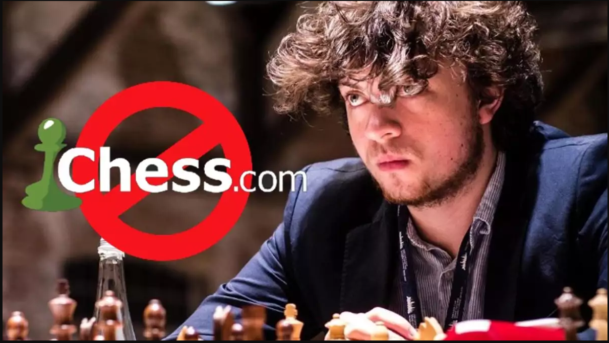
```

## The alleged coach/mentor
```{r dlugy, out.width = "48%", fig.cap = "Maxim Dlugy, suspected of \\& admitted to online cheating twice"}
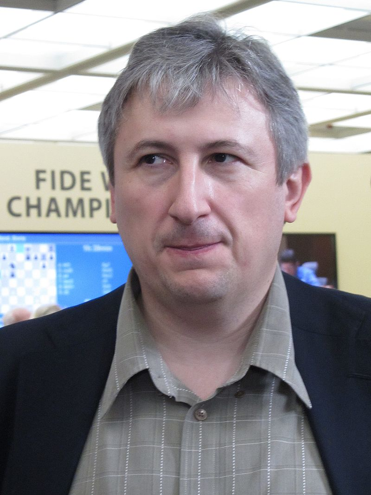
```

## World Champion
```{r carlsen, out.width = "48%", fig.cap = "Carlsen dominated classical chess for over 10 years"}

```

## Sinquefield Cup 2022
* Saint Louis Chess Club, Missouri
* 10 players, single round robin, over the board

```{r sinquefield, out.width = "98%", fig.cap = "Carlsen \\& Niemann played in the 3rd round"}
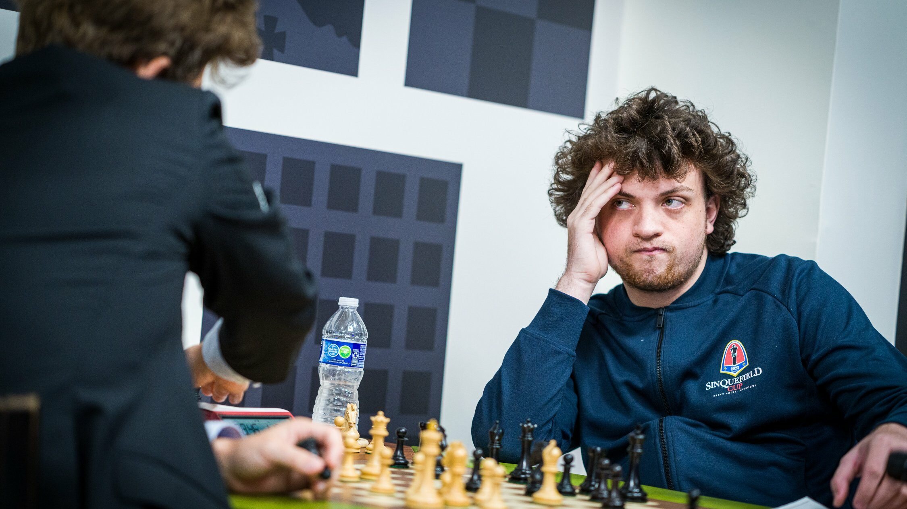
```

## Aftermath
* 2022-09-04: Carlsen lost with white pieces to Niemann

  - Carlsen's 53-game unbeaten streak in classical over the board tournaments ended
  - Niemann's live Elo rating surpassed 2700 for the first time

* 2022-09-05: Carlsen withdrew from the tournament, while organisers put in more anti-cheating measures

* 2022-09-21: Carlsen said he's "impressed by Niemann's play" and that Dlugy "must be doing a great job"

* 2022-09-26: Carlsen issued a statement accusing Niemann of cheating

* 2022-10-04: Chess.com issued a report and banned Niemann

* 2022-10-20: Niemann filed a $100 million defamation lawsuit against Carlsen, Chess.com and some others

## Circumstantial evidence for a statistical anomaly
* Niemann, in a post-match interview, claimed that he prepared the line (sequence of moves) after watching a Carlsen game
  - But he remembered the place and year incorrectly
  - Some found him nervous in the interview and fumbled explaining the lines

* Some questioned how Niemann miraculously prepared this particular line

* No evidence was found that
  - the line was leaked to Niemann
  - Niemann cheated during the game

* Niemann denied ever cheating over the board

## Statistical framework
* Is there a way of statistically inferring if somebody cheated or not?

* Frequentist: test $H_0$: Niemann didn't cheat, using games data

* Bayesian: calculate $\Pr(\text{Niemann cheated}|\text{games data})$

* Required:
  - a model that describes how moves are made with or without cheating
  - understanding of the behaviour / pattern of cheating
  - understanding of how human plays in general

## The human factor
* Time pressure

* Not remembering / mixing up a line

* Surprising opponent with a sub-optimal move

* **Fallibility**

## Ken Regan
```{r regan, out.width = "48%", fig.cap = "Credit: Sinna Nasseri for TIME"}
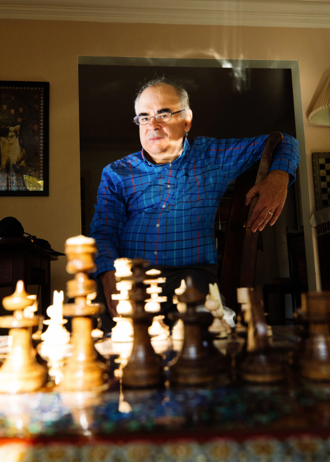
```

## @dhr09
* **"Skill rating by Bayesian inference"**

* The moves are the data

* Compare against a benchmark i.e. computer engine

* Probabiliity of making a particular move depends on:

  - The top candidate moves suggested by engine
  - The values associated with these moves
  - The strength $\lambda$
  - Some other (hyper)parameters

$$ \Pr(\text{candidate move }i)\propto(v_{\text{max}}-v_i+K)^{-\lambda} $$

## Toy example

::: columns

:::: {.column width="55%"}
```{r lines, out.width = "80%", fig.cap = "Source: https://chess24.com"}
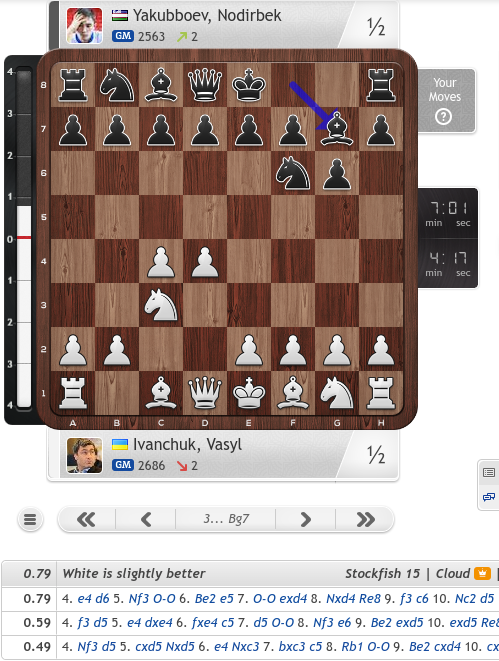
```
::::

:::: {.column width="45%"}

* $v_{\text{max}}=0.79,\quad{}K=0.1$

* Probability of e4 $\propto$
  $$(0.79 - 0.79 + 0.1)^{-\lambda}$$

* Probability of f3 $\propto$
  $$(0.79 - 0.59 + 0.1)^{-\lambda}$$

* Probability of Nf3 $\propto$
  $$(0.79 - 0.49 + 0.1)^{-\lambda}$$

* Larger $\lambda\Rightarrow$ more able to pick out best move

::::

:::

## Bayesian inference
* Iteratively apply the Bayesian rule

* $\mathcal{F}_n$: moves 1 to $n$ $\Rightarrow\mathcal{F}_n=\{F_{n-1},\text{move }n\}$

$$ \begin{aligned}
\pi(\lambda|\mathcal{F}_1)&=\pi(\lambda|\mathcal{F}_0,\text{move }1)\propto\Pr(\text{move }1|\lambda)\pi(\lambda)\\
\pi(\lambda|\mathcal{F}_2)&=\pi(\lambda|\mathcal{F}_1,\text{move 2})\propto\Pr(\text{move }2|\lambda,\mathcal{F}_1)\pi(\lambda|\mathcal{F}_1)
\end{aligned} $$

* They did this so that they can obtain (the distribution of) $\lambda$ over the moves, instead of just one at the end of the game

## Consistent with Elo
```{r dhr09-fig1, out.width = "48%", fig.cap = "Figure 1 of Di Fatta, Haworth, and Regan (2009)"}
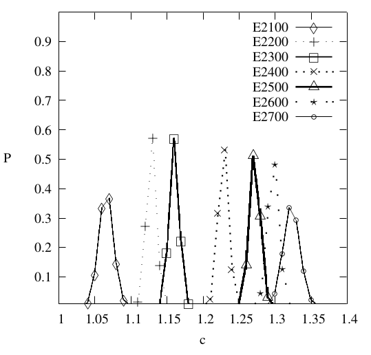
```

## Compare skill rating
* Between players of similar Elo rating

```{r dhr09-tab3, out.width = "80%", fig.cap = "Table 3 of Di Fatta, Haworth, and Regan (2009)"}
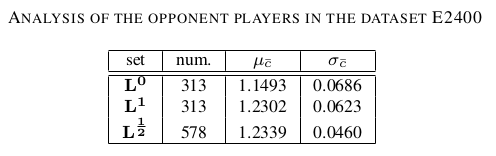
```

## Consistent with increasing draw percentage?
```{r more-draws-yes-again, fig.cap = "Previously shown figure on increasing draw percentage", out.width = "98%"}

```

* Different ranges of Elo rating though

## Two other papers

* @hrd10

* @hbr15

* Not much being offered on cheating detection apart from **Move Matching**
  - Percentage of matches with computer engine moves
  - This is what some focus on when accusing Niemann of cheating

* I'm still none the wiser

## Regan's more recent analysis
* **Raw outlier index**, based on move matching
  - $50$: perform at Elo rating
  - $<50$: worse than Elo rating
  - $>50$: better than Elo rating

* Niemann's performance doesn't show anomaly

* This requires Elo rating being accurate & up-to-date

## A smart cheater
* Just cheat at some key moves

* Only cheat at one or two games in a tournament

* Regan's methods at best **help** to keep chess fair

## Coming back to the basics
* People mixing up the two
$$ \begin{aligned}
&\Pr(\text{cheat}|\text{win})\\
=~&\frac{\Pr(\text{cheat})\Pr(\text{win}|\text{cheat})}{\Pr(\text{cheat})\Pr(\text{win}|\text{cheat})+(1-\Pr(\text{cheat}))\Pr(\text{win}|\text{not cheat})}
\end{aligned} $$

* High prior $\Pr(\text{cheat})$ by some

* $\Pr(\text{win}|\text{not cheat})$ by strength

  - Either outcome or skill rating

* $\Pr(\text{win}|\text{cheat})$ difficult to determine

  - Need to understand how to do it over the board

## Last night
```{r gotham, fig.cap = "https://www.youtube.com/watch?v=P4LnwRHGIHg", out.width = "90%"}
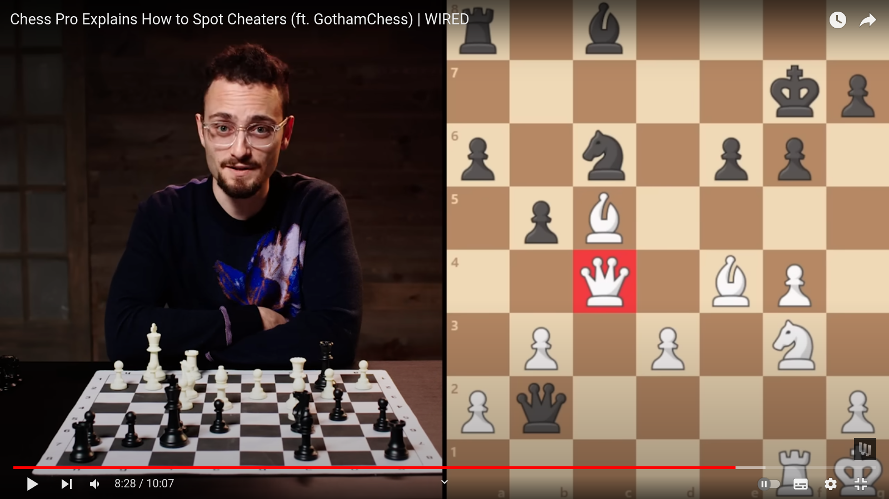
```

## (More) final thoughts
* Different techniques to cheat online and over the board

  - Unfair $\Pr(\text{cheat})$ for Niemann?

* Same / similar instantaneous outcome

  - One of the top moves
  
  - Elevated $\lambda?$

* "A human would not play this kind of moves"

  - **Style** of player from historical games

  - Moves closer to computer engine or their own style

## Bibliography {.allowframebreaks}