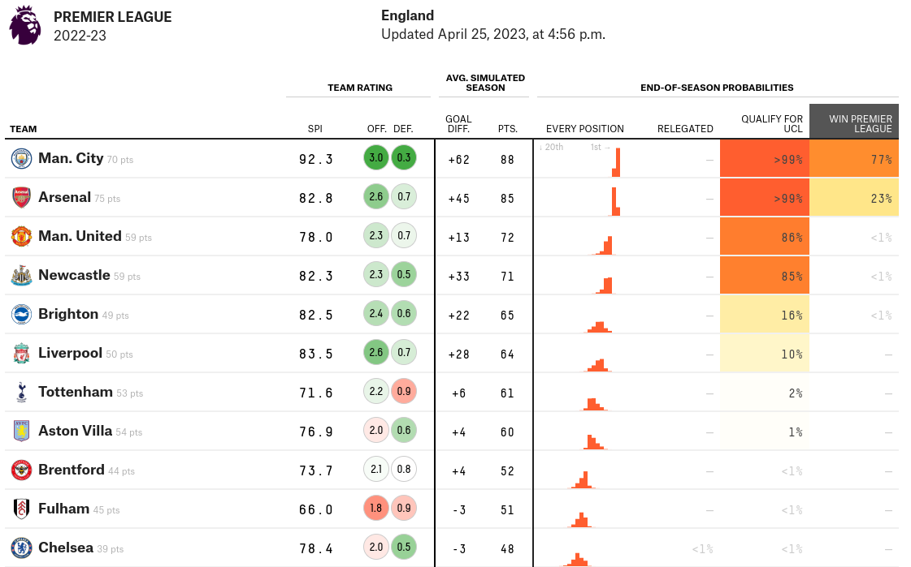
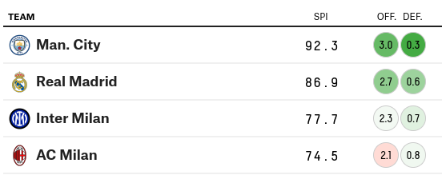
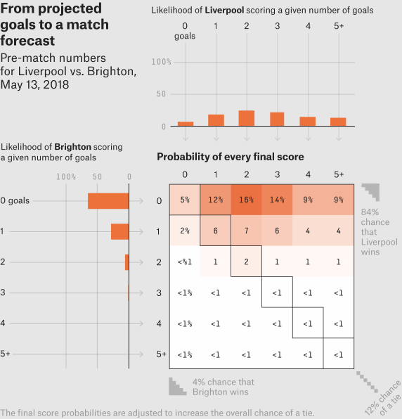
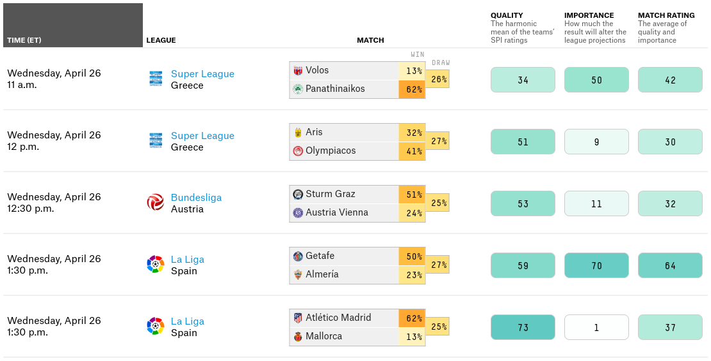
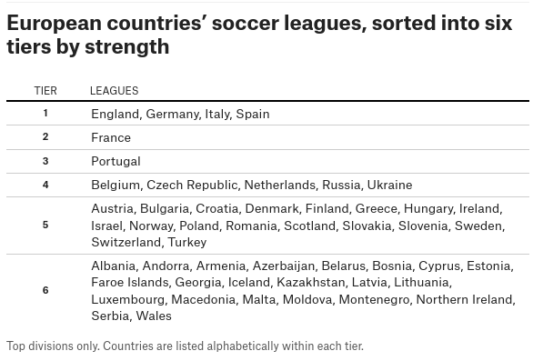
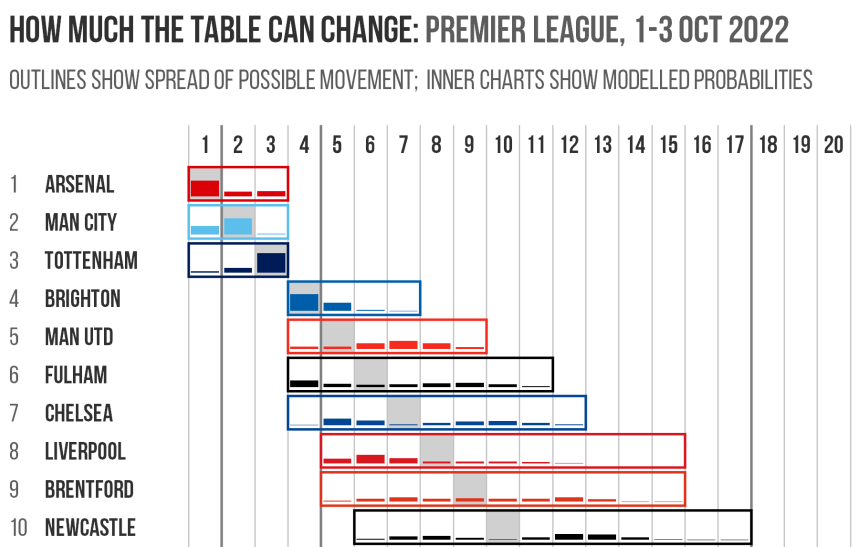
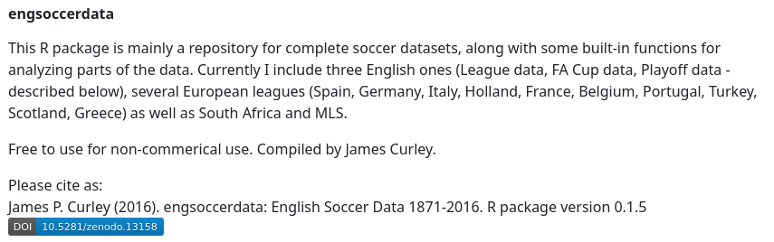

```{r preamble, echo = FALSE}
library(knitr)
opts_chunk$set(echo = FALSE, fig.align = "center", out.width = "80%")
```

## Nate Silver

```{r nate, out.width = "50%"}

```

## Nate Silver

* Predicted the outcomes in all but one states in 2008 U.S. presidential election

  * 2008: All states but one

  * 2012: All states

  * 2016: Least worst of major forecasts

  * 2020: All states

* 538 electors in the Electoral College

## FiveThirtyEight

* Does other forecasts as well

```{r 538_PL}

```

## Outline

1. Soccer Power Index (SPI)

    * Nate originally devised for ESPN

    * Revised substantially over the years

2. Forecasting

    * Poisson model

    * Monte Carlo simulations

3. Leagues and tiers

    * For e.g. Champions League

# Soccer Power Index (SPI)

## What is SPI?

* Overall rating: **the percentage of available points expected to take**

* Used in turn for the simulations

## Pre-season SPI

* $2/3~\times$ end-of-season's SPI + $1/3~\times$ SPI implied by market value

* Reason: market value strongly correlated with end-of-season SPI

## SPI during season

* Updated after each match

* Calculated according to an **offensive rating** and **a defensive rating**

    - Opaque about how

```{r 538_CL}

```

## Offensive rating

* Goals expected to score against an "average" team

* Using actual goals?

    - Scoreline often disagrees with people's impressions of the quality of each team's play

    - Low-scoring nature $\rightarrow$ prolonged periods of luck (good results despite playing poorly), or vice versa

## Offensive rating

Average of 

1. ~~Goals~~

2. Adjusted goals

3. Shot-based expected goals

4. Non-shot expected goals

Defensive rating $=$ offensive rating of opposing team

* High defensive rating is bad

## Adjusted goals

* Reducing value of goals scored when more players

* Reducing value of goals scored late when leading

* Increasing value of other goals to add up to total # actual goals

## Shot-based expected goals

* Each shot assigned a probability based on distance & angle

* Part of the body the shot was taken with

* Adjustment for the player

## Non-shot expected goals

* Passes, interceptions, take-ons and tackles

* Intercepting the ball at opposing team's penalty spot leads to a goal $\approx$ 9% of the time

* Pass completed at the center of the six-yard box leads to a goal $\approx$ 14% of the time

## SPI pipeline

1. End-of-season SPI & market value $\rightarrow$ pre-season SPI

2. Use current SPI to forecast match result (next section)

3. Use match data to calculate offensive & defensive ratings

4. Update current SPI after match using the ratings

   * Unlike ELO, a win doesn't necessarily improve SPI

# Forecasting

## Simulating number of goals

* Poisson with mean the offensive rating

* Adjusted for

    - league-specific home-field advantage
    
    - **importance** of the match to each team

* Two independent Poisson distributions

* Inflated for draws (league-specific, around 9%)

## Scoring matrix

```{r scoring_matrix, out.width = "50%"}

```

## Importance, quality, match rating

```{r 538_metrics}

```

## Monte Carlo simulations

* Using the scoring matrix

* Teams' SPI can rise and fall depending on simulated matches played

* Widened distribution of possible outcomes

## Whole pipeline

1. End-of-season SPI & market value $\rightarrow$ pre-season SPI

2. Use current SPI to forecast match result (next section)

3. Use match data to calculate offensive & defensive ratings

4. (Update current SPI after match using the ratings)

5. Build scoring matrix using offensive ratings & draw inflation

6. Simulate the (remaining) matches of the season

## Performance - Ranked Probability Score (RPS)

* Measures how good forecasts are in matching observed outcomes

* RPS = 0: wholly accurate; RPS = 1: wholly inaccurate

* Current RPS = 0.1957 after reductions:

    - by 0.0018 using expected-goals metrics

    - by 0.0011 using market values to pre-season SPI

    - by 0.0006 using match importance

# Leagues and tiers

## Relative strengths between leagues

* For predictions of e.g. Champions League

* Originally used a tiered system

```{r 538_tier, out.width = "60%"}

```

## Current version

1. Calculate SPI using domestic league results only

2. Calculate expected scores of inter-league matches using domestic SPI

3. Apply Massey's method to actual $-$ expected scores to find **league strengths**

4. Regress league strengths toward market-value based ratings

5. Run through all matches again, this time with the league strengths

Interpretation: bonus (in goals) given to each team in an inter-league match

## Summary

Modularised approach

1. Match data to calculate offensive/defensive ratings
    
2. Offensive ratings to calculate scoring matrix, with adjustments
    
3. Scoring matrix to simulate future matches
    
4. Domestic results to compute league strengths

## Extra 1: \@Experimental361

```{r 361_PL}

```

## Extra 2: Engsoccerdata GitHub repository

https://github.com/jalapic/engsoccerdata

```{r engsoccerdata, out.width = "90%"}

```