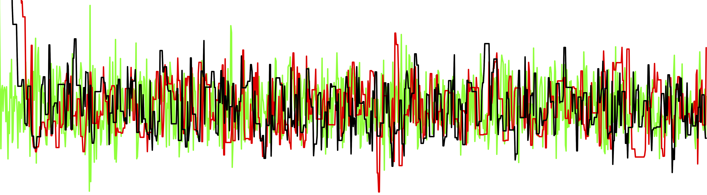

```{r setup, include=FALSE}
knitr::opts_chunk$set(echo = FALSE, fig.align = "center")
```

## Icebreaker

:::::: {.columns}
::: {.column width="49%" data-latex="{\textwidth}"}
* A 40-year-old woman has a mammogram (screening) as a routine checkup.

* Her test result is abnormal.
  
* **What is the probability she actually has breast cancer?**
  - 10% of women get abnormal results (whether cancer is present or not).
  - 80% of breast cancer patients get abnormal results.
:::
::: {.column width="2%" data-latex="{\textwidth}"}
\ 
:::
::: {.column width="49%" data-latex="{\textwidth}"}

```{r image-url}
url <- "https://breastcancersupport.org.uk/wp-content/uploads/2020/12/Mammogram-Machine.jpg"
```

<center>

<figcaption>
source: https://breastcancersupport.org.uk/
</figcaption>
</center>
:::
::::::

## Icebreaker

:::::: {.columns}
::: {.column width="49%" data-latex="{\textwidth}"}
* A 40-year-old woman has a mammogram (screening) as a routine checkup.

* Her test result is abnormal.
  
* **What is the probability she actually has breast cancer?**
  - 10% of women get abnormal results (whether cancer is present or not).
  - 80% of breast cancer patients get abnormal results.
  - 0.4% of women have breast cancer.
:::
::: {.column width="2%" data-latex="{\textwidth}"}
\ 
:::
::: {.column width="49%" data-latex="{\textwidth}"}

<center>

<figcaption>
source: https://breastcancersupport.org.uk/
</figcaption>
</center>
:::
::::::

## Bayes rule

:::::: {.columns}
::: {.column width="59%" data-latex="{\textwidth}"}

* $0.004 \times 0.8 / 0.1 = 0.032$

* Prior knowledge: **breast cancer prevalence**

* Data: **abnormal mammogram (for the woman)**

* Outcome: **breast cancer probability (for the woman)**

* Counterintuitive:

  - If breast cancer $\rightarrow$ high chance of abnormal result (80%)
  - If abnormal result $\rightarrow$ low chance of breast cancer (3.2%)

:::
::: {.column width="2%" data-latex="{\textwidth}"}
\ 
:::
::: {.column width="39%" data-latex="{\textwidth}"}

```{r image}
#| fig.align: "left"
#| out.width: "80%"
knitr::include_graphics("https://a.media-amazon.com/images/I/61NCijesjSL._SL1000_.jpg")
```
:::
::::::

## Another example 

* Let's go interactive

* https://bit.ly/first-bayes

## In this module

:::::: {.columns}
::: {.column width="49%" data-latex="{\textwidth}"}

* Same goal: obtain the posterior 
  - that combines data & prior knowledge

* More complex models and data
  - with the help of computational statistics
  - Markov chain Monte Carlo

* Want to know more?
  - clement.lee@newcastle.ac.uk
  - I will also teach MAS8403

:::
::: {.column width="2%" data-latex="{\textwidth}"}
\ 
:::
::: {.column width="49%" data-latex="{\textwidth}"}

```{r traceplot}
#| fig.align: "left"
#| out.width: "100%"

```
:::
::::::
