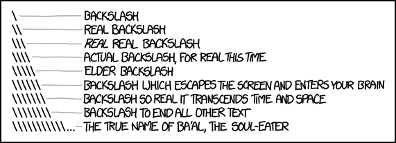

```{r setup, include=FALSE}
knitr::opts_chunk$set(echo = TRUE)
underline <- function(x) {
  if (knitr::is_latex_output()) {
    sprintf("\\text{\\underline{%s}}", x)
  } else if (knitr::is_html_output()) {
    sprintf("<span style='text-decoration:underline'>%s</span>", x)
  } else x
}
```

## When inheriting a module
:::::: {.columns}
::: {.column width="48%" data-latex="{\textwidth}"}
**Usual file structure**

* Some .tex files & the generated .pdf
  - verbatim `R` code & output in .tex
* figures/ or graphics/:
  - generated for `\includegraphics` in .tex
  - .eps, .ps, .png, .jpg, .pdf, .gif
* `R`-related files:
  - .R that generates the output & figures
  - .RData, .rds, .Rd
* "By-products":
  - .out, .log, .dvi, .blg, .bbl, .aux, .synctex.gz
* Miscellaneous:
  - .csv, .txt, .stan, .sty
  - .pdf of scanned solutions
* But no README
  - maybe a makefile

:::
::: {.column width="4%" data-latex="{\textwidth}"}
\ 
<!-- an empty Div (with a white space), serving as
a column separator -->
:::
::: {.column width="48%" data-latex="{\textwidth}"}
$~$
:::
::::::

## Scope
:::::: {.columns}
::: {.column width="48%" data-latex="{\textwidth}"}
**A single set of source scripts**

* Code + text combined
  - Reproducible
  - No more separate R scripts
* Both HTML & PDF outputs
  - Accessible
  - Alternative to Chirun
* Both questions/gaps & solutions
  - A parameter that toggles between the two
* Script-based
  - Easy to version control
  - As little scaffolding as possible
* Language agnostic
  - Less painful to switch from R to Python?
* Initial time cost
  - Lower priority
  - Focus on future savings

:::
::: {.column width="4%" data-latex="{\textwidth}"}
\ 
<!-- an empty Div (with a white space), serving as
a column separator -->
:::
::: {.column width="48%" data-latex="{\textwidth}"}
**This talk**

1. R Markdown basics
2. Bookdown for notes
3. Practical considerations

:::
::::::


# 1. R Markdown basics

## LaTeX
:::::: {.columns}
::: {.column width="48%" data-latex="{\textwidth}"}
`r underline("The source file (.tex)")`
````{verbatim, lang = "latex"}
\begin{itemize}
  \item $\pi=3.1415927\dots$ is \textit{irrational} \& \textbf{transcendental}
  \item Type \texttt{pi} in \verb'R' console for numerical value
\end{itemize}
````

````{verbatim, lang = "latex"}
\begin{verbatim}
2 * pi

  ## [1] 6.283185
\end{verbatim}
````

````{verbatim, lang = "latex"}
Question: Show that $e^{i\pi}+1=0$.\\
Solution:
\begin{align*}
  e^{i\pi}+1&=\cos\pi+i\sin\pi+1\\
  &=-1+i\times0+1=0
\end{align*}
````

````{verbatim, lang = "latex"}
% A comment that won't appear in the output.
````
:::
::: {.column width="4%" data-latex="{\textwidth}"}
\ 
<!-- an empty Div (with a white space), serving as
a column separator -->
:::
::: {.column width="48%" data-latex="{\textwidth}"}
`r underline("The output (.pdf)")`  

- $\pi=3.1415927\dots$ is *irrational* & **transcendental**
- Type `pi` in `R` console for numerical value

$\quad$  
```r
2 * pi
```

```
## [1] 6.283185
```

$\quad$  
Question: Show that $e^{i\pi}+1=0$.  
Solution:
\begin{align*}
  e^{i\pi}+1&=\cos\pi+i\sin\pi+1\qquad\qquad\qquad\qquad\\
  &=-1+i\times0+1=0
\end{align*}
:::
::::::

## R Sweave
:::::: {.columns}
::: {.column width="48%" data-latex="{\textwidth}"}
`r underline("The source file (.Rnw)")`
````{verbatim, lang = "latex"}
\begin{itemize}
  \item $\pi=\Sexpr{pi}\dots$ is \textit{irrational} \& \textbf{transcendental}
  \item Type \texttt{pi} in \verb'R' console for numerical value
\end{itemize}
````

````{verbatim, lang = "latex"}
<<>>=
2 * pi
@
  
  
````

````{verbatim, lang = "latex"}
Question: Show that $e^{i\pi}+1=0$.\\
Solution:
\begin{align*}
  e^{i\pi}+1&=\cos\pi+i\sin\pi+1\\
  &=-1+i\times0+1=0
\end{align*}
````

````{verbatim, lang = "latex"}
% A comment that won't appear in the output.
````
:::
::: {.column width="4%" data-latex="{\textwidth}"}
\ 
<!-- an empty Div (with a white space), serving as
a column separator -->
:::
::: {.column width="48%" data-latex="{\textwidth}"}
`r underline("The output (.pdf)")`  

- $\pi=`r pi`\dots$ is *irrational* & **transcendental**
- Type `pi` in `R` console for numerical value

$\quad$  
```{r}
2 * pi
```

$\quad$  
Question: Show that $e^{i\pi}+1=0$.  
Solution:
\begin{align*}
  e^{i\pi}+1&=\cos\pi+i\sin\pi+1\qquad\qquad\qquad\qquad\\
  &=-1+i\times0+1=0
\end{align*}
:::
::::::

## R Markdown
:::::: {.columns}
::: {.column width="48%" data-latex="{\textwidth}"}
`r underline("The source file (.Rmd)")`
````{verbatim, lang = "markdown"}

* $\pi=`r pi`\dots$ is *irrational* & **transcendental**
* Type `pi` in `R` console for numerical value  
  
````

````{verbatim, lang = "markdown"}
```{r}
2 * pi

  
```  
````

````{verbatim, lang = "markdown"}
Question: Show that $e^{i\pi}+1=0$.  
Solution:
\begin{align*}
  e^{i\pi}+1&=\cos\pi+i\sin\pi+1\\
  &=-1+i\times0+1=0
\end{align*}
````

````{verbatim, lang = "markdown"}
<!-- A comment that won't appear in the output. -->
````
:::
::: {.column width="4%" data-latex="{\textwidth}"}
\ 
<!-- an empty Div (with a white space), serving as
a column separator -->
:::
::: {.column width="48%" data-latex="{\textwidth}"}
`r underline("The output (.pdf / .html)")`  


* $\pi=`r pi`\dots$ is *irrational* & **transcendental**
* Type `pi` in `R` console for numerical value

$\quad$  
```{r}
2 * pi

  
```  

$\quad$  
Question: Show that $e^{i\pi}+1=0$.  
Solution:
\begin{align*}
  e^{i\pi}+1&=\cos\pi+i\sin\pi+1\qquad\qquad\qquad\qquad\\
  &=-1+i\times0+1=0
\end{align*}
:::
::::::

## Chunk options
:::::: {.columns}
::: {.column width="48%" data-latex="{\textwidth}"}
`r underline("For displaying / hiding code / plots")`
````{verbatim, lang = "markdown"}
  
  
  
  
  
  
```{r, out.width = "70%"}
plot(cars)
```
````
:::
::: {.column width="4%" data-latex="{\textwidth}"}
\ 
<!-- an empty Div (with a white space), serving as
a column separator -->
:::
::: {.column width="48%" data-latex="{\textwidth}"}
`r underline("The output (.pdf / .html)")`  
```{r, out.width = "70%"}
plot(cars)
```

:::
::::::

## Chunk options
:::::: {.columns}
::: {.column width="48%" data-latex="{\textwidth}"}
`r underline("Hide the code")`
````{verbatim, lang = "markdown"}
  
  
  
  
  
  
```{r, out.width = "70%", echo = FALSE}
plot(cars)
```
````
:::
::: {.column width="4%" data-latex="{\textwidth}"}
\ 
<!-- an empty Div (with a white space), serving as
a column separator -->
:::
::: {.column width="48%" data-latex="{\textwidth}"}
`r underline("The output (.pdf / .html)")`  
```{r, out.width = "70%", echo = FALSE}
plot(cars)
```

:::
::::::

## Chunk options
:::::: {.columns}
::: {.column width="48%" data-latex="{\textwidth}"}
`r underline("Don't evaluate")`
````{verbatim, lang = "markdown"}
  
  
  
  
  
  
```{r, out.width = "70%", eval = FALSE}
plot(cars)
```
````
Also useful when showing code that doesn't work
:::
::: {.column width="4%" data-latex="{\textwidth}"}
\ 
<!-- an empty Div (with a white space), serving as
a column separator -->
:::
::: {.column width="48%" data-latex="{\textwidth}"}
`r underline("The output (.pdf / .html)")`  
```{r, out.width = "70%", eval = FALSE}
plot(cars)
```

:::
::::::

## Chunk options
:::::: {.columns}
::: {.column width="48%" data-latex="{\textwidth}"}
`r underline("Hide the plots (but still evaluate)")`
````{verbatim, lang = "markdown"}
  
  
  
  
  
  
```{r, out.width = "70%", fig.show = "hide"}
plot(cars)
```
````
:::
::: {.column width="4%" data-latex="{\textwidth}"}
\ 
<!-- an empty Div (with a white space), serving as
a column separator -->
:::
::: {.column width="48%" data-latex="{\textwidth}"}
`r underline("The output (.pdf / .html)")`  
```{r, out.width = "70%", fig.show = "hide"}
plot(cars)
```

:::
::::::

## Chunk options
:::::: {.columns}
::: {.column width="48%" data-latex="{\textwidth}"}
`r underline("Hide the code \\& results (but still evaluate)")`
````{verbatim, lang = "markdown"}
  
  
  
  
  
  
```{r, out.width = "70%", include = FALSE}
plot(cars)
```
````
:::
::: {.column width="4%" data-latex="{\textwidth}"}
\ 
<!-- an empty Div (with a white space), serving as
a column separator -->
:::
::: {.column width="48%" data-latex="{\textwidth}"}
`r underline("The output (.pdf / .html)")`  
```{r, out.width = "70%", include = FALSE}
plot(cars)
```

:::
::::::

## Toggle for questions & solutions
:::::: {.columns}
::: {.column width="48%" data-latex="{\textwidth}"}
`r underline("Question version")`
````{verbatim, lang = "markdown"}


1. Plot the `cars` dataset in `R`.
```{r, out.width = "70%", include = FALSE}
plot(cars)
```
2. Find the numerical value of $2\pi$, to 4 decimal places.
```{r, include = FALSE}
round(2 * pi, 4)
```
````
:::
::: {.column width="4%" data-latex="{\textwidth}"}
\ 
<!-- an empty Div (with a white space), serving as
a column separator -->
:::
::: {.column width="48%" data-latex="{\textwidth}"}
`r underline("The output (.pdf / .html)")`  

1. Plot the `cars` dataset in `R`.
```{r, out.width = "70%", include = FALSE}
plot(cars)
```

2. Find the numerical value of $2\pi$, to 4 decimal places.
```{r, include = FALSE}
round(2 * pi, 4)
```
:::
::::::

## Toggle for questions & solutions
:::::: {.columns}
::: {.column width="48%" data-latex="{\textwidth}"}
`r underline("Solution version")`
````{verbatim, lang = "markdown"}


1. Plot the `cars` dataset in `R`.
```{r, out.width = "70%", include = TRUE}
plot(cars)
```
2. Find the numerical value of $2\pi$, to 4 decimal places.
```{r, include = TRUE}
round(2 * pi, 4)
```
````
:::
::: {.column width="4%" data-latex="{\textwidth}"}
\ 
<!-- an empty Div (with a white space), serving as
a column separator -->
:::
::: {.column width="48%" data-latex="{\textwidth}"}
`r underline("The output (.pdf / .html)")`    

1. Plot the `cars` dataset in `R`.
```{r, out.width = "70%", include = TRUE}
plot(cars)
```

2. Find the numerical value of $2\pi$, to 4 decimal places.
```{r, include = TRUE}
round(2 * pi, 4)
```
:::
::::::

## Parametrise the toggle
:::::: {.columns}
::: {.column width="48%" data-latex="{\textwidth}"}
`r underline("Between the triple dashes: YAML similar to LaTeX preamble")`
````{verbatim, lang = "markdown"}
---
title: "MAS9999 Practical 1"
params:
  solution: ""
---
1. Plot the `cars` dataset in `R`.
```{r, out.width = "70%", include = params$solution}
plot(cars)
```
2. Find the numerical value of $2\pi$, to 4 decimal places.
```{r, include = params$solution}
round(2 * pi, 4)
```
````
Call this file Practical1.Rmd
:::
::: {.column width="4%" data-latex="{\textwidth}"}
\ 
<!-- an empty Div (with a white space), serving as
a column separator -->
:::
::: {.column width="48%" data-latex="{\textwidth}"}
$~$
:::
::::::

## One script to render them all
:::::: {.columns}
::: {.column width="48%" data-latex="{\textwidth}"}
`r underline("Run the commands (interactively) in R")`
```{r, eval = FALSE}
library(rmarkdown)
render("Practical1.Rmd", params = list(solution = FALSE),
       output_format = "html_document", 
       output_file = "Practical1_questions.html")
                   
render("Practical1.Rmd", params = list(solution = FALSE),
       output_format = "pdf_document", 
       output_file = "Practical1_questions.pdf")
                   
render("Practical1.Rmd", params = list(solution = TRUE),
       output_format = "html_document", 
       output_file = "Practical1_solutions.html")
                   
render("Practical1.Rmd", params = list(solution = TRUE),
       output_format = "pdf_document", 
       output_file = "Practical1_solutions.pdf")
```
* Or run non-interactively in a terminal, or put them in a makefile
* Intermediate files gone, unless you specify them to be kept

:::
::: {.column width="4%" data-latex="{\textwidth}"}
\ 
<!-- an empty Div (with a white space), serving as
a column separator -->
:::
::: {.column width="48%" data-latex="{\textwidth}"}
$~$
:::
::::::

## What about text & equations?
:::::: {.columns}
::: {.column width="48%" data-latex="{\textwidth}"}
`r underline("Originally")`
````{verbatim, lang = "markdown"}
Question: Show that $e^{i\pi}+1=0$.  

Solution:
\begin{align*}
  e^{i\pi}+1&=\cos\pi+i\sin\pi+1\\
  &=-1+i\times0+1=0
\end{align*}
````
No native solution environment AFAIK
:::
::: {.column width="4%" data-latex="{\textwidth}"}
\ 
<!-- an empty Div (with a white space), serving as
a column separator -->
:::
::: {.column width="48%" data-latex="{\textwidth}"}
`r underline("The output (.pdf / .html)")`  

Question: Show that $e^{i\pi}+1=0$.  

Solution:
\begin{align*}
  e^{i\pi}+1&=\cos\pi+i\sin\pi+1\\
  &=-1+i\times0+1=0
\end{align*}
:::
::::::

## What about text & equations?
:::::: {.columns}
::: {.column width="48%" data-latex="{\textwidth}"}
`r underline("Making solution text a string in R")`
````{verbatim, lang = "markdown"}
Question: Show that $e^{i\pi}+1=0$.  

```{r, results = "asis", echo = FALSE, include = TRUE}
cat("Solution:
     \\begin{align*}
       e^{i\\pi}+1&=\\cos\\pi+i\\sin\\pi+1\\\\
       &=-1+i\\times0+1=0
     \\end{align*}", "\n")
```
````
Double the backslashes  

```{r, echo = FALSE, out.width = "80%"}

```

https://xkcd.com/1638/
:::
::: {.column width="4%" data-latex="{\textwidth}"}
\ 
<!-- an empty Div (with a white space), serving as
a column separator -->
:::
::: {.column width="48%" data-latex="{\textwidth}"}
`r underline("The output (.pdf / .html)")`  

Question: Show that $e^{i\pi}+1=0$.

```{r, results = "asis", echo = FALSE}
cat("Solution:
     \\begin{align*}
       e^{i\\pi}+1&=\\cos\\pi+i\\sin\\pi+1\\\\
       &=-1+i\\times0+1=0
     \\end{align*}", "\n")
```
:::
::::::

## What about text & equations?
:::::: {.columns}
::: {.column width="48%" data-latex="{\textwidth}"}
`r underline("The question version")`
````{verbatim, lang = "markdown"}
Question: Show that $e^{i\pi}+1=0$.  

```{r, results = "asis", echo = FALSE, include = FALSE}
cat("Solution:
     \\begin{align*}
       e^{i\\pi}+1&=\\cos\\pi+i\\sin\\pi+1\\\\
       &=-1+i\\times0+1=0
     \\end{align*}", "\n")
```
````
:::
::: {.column width="4%" data-latex="{\textwidth}"}
\ 
<!-- an empty Div (with a white space), serving as
a column separator -->
:::
::: {.column width="48%" data-latex="{\textwidth}"}
`r underline("The output (.pdf / .html)")`  

Question: Show that $e^{i\pi}+1=0$.

```{r, results = "asis", echo = FALSE, include = FALSE}
cat("Solution:
     \\begin{align*}
       e^{i\\pi}+1&=\\cos\\pi+i\\sin\\pi+1\\\\
       &=-1+i\\times0+1=0
     \\end{align*}", "\n")
```
:::
::::::

## Full example, the questions
:::::: {.columns}
::: {.column width="48%" data-latex="{\textwidth}"}
`r underline("Practical1.Rmd")`
````{verbatim, lang = "markdown"}
---
title: "MAS9999 Practical 1"
params:
  solution: ""
---
1. Write `R` code to plot the `cars` dataset.
```{r, include = params$solution, fig.show = "hide"}
plot(cars)
```
2. Find the numerical value of $2\pi$, to 4 decimal places.
```{r, include = params$solution}

round(2 * pi, 4)
```
3. Show that $e^{i\pi}+1=0$.  
```{r, results = "asis", echo = FALSE, include = params$solution}
cat("Solution:
     \\begin{align*}
       e^{i\\pi}+1&=\\cos\\pi+i\\sin\\pi+1\\\\
       &=-1+i\\times0+1=0
     \\end{align*}", "\n")
```
````

```{r, eval = FALSE}
library(rmarkdown)
render("Practical1.Rmd", params = list(solution = FALSE),
       output_format = "html_document", 
       output_file = "Practical1_questions.html")
```
:::
::: {.column width="4%" data-latex="{\textwidth}"}
\ 
<!-- an empty Div (with a white space), serving as
a column separator -->
:::
::: {.column width="48%" data-latex="{\textwidth}"}
`r underline("The output (Practical1\\_questions.html)")`  
$\qquad$  
$\qquad$  
$\qquad\qquad$ MAS9999 Practical 1

1. Write `R` code to plot the `cars` dataset.
```{r, include = FALSE, fig.show = "hide"}
plot(cars)
```
2. Find the numerical value of $2\pi$, to 4 decimal places.
```{r, include = FALSE}
round(2 * pi, 4)
```
3. Show that $e^{i\pi}+1=0$.  
```{r, results = "asis", echo = FALSE, include = FALSE}
cat("Solution:
     \\begin{align*}
       e^{i\\pi}+1&=\\cos\\pi+i\\sin\\pi+1\\\\
       &=-1+i\\times0+1=0
     \\end{align*}", "\n")
```
:::
::::::

## Full example, the solutions
:::::: {.columns}
::: {.column width="48%" data-latex="{\textwidth}"}
`r underline("Practical1.Rmd")`
````{verbatim, lang = "markdown"}
---
title: "MAS9999 Practical 1"
params:
  solution: ""
---
1. Write `R` code to plot the `cars` dataset.
```{r, include = params$solution, fig.show = "hide"}
plot(cars)
```
2. Find the numerical value of $2\pi$, to 4 decimal places.
```{r, include = params$solution}

round(2 * pi, 4)
```
3. Show that $e^{i\pi}+1=0$.  
```{r, results = "asis", echo = FALSE, include = params$solution}
cat("Solution:
     \\begin{align*}
       e^{i\\pi}+1&=\\cos\\pi+i\\sin\\pi+1\\\\
       &=-1+i\\times0+1=0
     \\end{align*}", "\n")
```
````

```{r, eval = FALSE}
library(rmarkdown)
render("Practical1.Rmd", params = list(solution = TRUE),
       output_format = "html_document", 
       output_file = "Practical1_solutions.html")
```
:::
::: {.column width="4%" data-latex="{\textwidth}"}
\ 
<!-- an empty Div (with a white space), serving as
a column separator -->
:::
::: {.column width="48%" data-latex="{\textwidth}"}
`r underline("The output (Practical1\\_solutions.html)")`  
$\qquad$  
$\qquad$  
$\qquad\qquad$ MAS9999 Practical 1

1. Write `R` code to plot the `cars` dataset.
```{r, include = TRUE, fig.show = "hide"}
plot(cars)
```

2. Find the numerical value of $2\pi$, to 4 decimal places.
```{r, include = TRUE}
round(2 * pi, 4)
```
3. Show that $e^{i\pi}+1=0$.  
```{r, results = "asis", echo = FALSE, include = TRUE}
cat("Solution:
     \\begin{align*}
       e^{i\\pi}+1&=\\cos\\pi+i\\sin\\pi+1\\\\
       &=-1+i\\times0+1=0
     \\end{align*}", "\n")
```
:::
::::::

## Language agnostic(-ish)
:::::: {.columns}
::: {.column width="48%" data-latex="{\textwidth}"}
`r underline("R, Python and maths questions")`
````{verbatim, lang = "markdown"}
---
title: "MAS9999 Practical 1"
params:
  solution: ""
---
1. Write `R` code to plot the `cars` dataset.
```{r, include = params$solution, fig.show = "hide"}
plot(cars)
```
2. Find the numerical value of $2\pi$, to 4 decimal places.
```{python, include = params$solution}
import math
round(2 * math.pi, 4)
```
3. Show that $e^{i\pi}+1=0$.  
```{r, results = "asis", echo = FALSE, include = params$solution}
cat("Solution:
     \\begin{align*}
       e^{i\\pi}+1&=\\cos\\pi+i\\sin\\pi+1\\\\
       &=-1+i\\times0+1=0
     \\end{align*}", "\n")
```
````

```{r, eval = FALSE}
library(rmarkdown)
render("Practical1.Rmd", params = list(solution = TRUE),
       output_format = "html_document", 
       output_file = "Practical1_solutions.html")
```
:::
::: {.column width="4%" data-latex="{\textwidth}"}
\ 
<!-- an empty Div (with a white space), serving as
a column separator -->
:::
::: {.column width="48%" data-latex="{\textwidth}"}
`r underline("The output (Practical1\\_solutions.html)")`  
$\qquad$  
$\qquad$  
$\qquad\qquad$ MAS9999 Practical 1

1. Write `R` code to plot the `cars` dataset.
```{r, include = TRUE, fig.show = "hide"}
plot(cars)
```

2. Find the numerical value of $2\pi$, to 4 decimal places.
```{python, include = TRUE}
import math
round(2 * math.pi, 4)
```
3. Show that $e^{i\pi}+1=0$.  
```{r, results = "asis", echo = FALSE, include = TRUE}
cat("Solution:
     \\begin{align*}
       e^{i\\pi}+1&=\\cos\\pi+i\\sin\\pi+1\\\\
       &=-1+i\\times0+1=0
     \\end{align*}", "\n")
```
:::
::::::

## Quarto
:::::: {.columns}
::: {.column width="48%" data-latex="{\textwidth}"}
`r underline("Practical1.qmd")`
````{verbatim, lang = "markdown"}
---
title: "MAS9999 Practical 1"
params:
  solution: ""
---
1. Write `R` code to plot the `cars` dataset.
```{r}
#| include: !expr params$solution
#| fig.show: "hide"
plot(cars)
```
2. Find the numerical value of $2\pi$, to 4 decimal places.
```{r}
#| include: !expr params$solution
round(2 * pi, 4)
```
3. Show that $e^{i\pi}+1=0$.  
```{r}
#| results: "asis"
#| echo: FALSE
#| include: !expr params$solution
cat("Solution:
     \\begin{align*}
       e^{i\\pi}+1&=\\cos\\pi+i\\sin\\pi+1\\\\
       &=-1+i\\times0+1=0
     \\end{align*}", "\n")
```
````

```{r, eval = FALSE}
library(quarto)
quarto_render("Practical1.qmd", execute_params = list(solution = "true"),
              output_format = "html", 
              output_file = "Practical1_solutions.html")
```
:::
::: {.column width="4%" data-latex="{\textwidth}"}
\ 
<!-- an empty Div (with a white space), serving as
a column separator -->
:::
::: {.column width="48%" data-latex="{\textwidth}"}
`r underline("The output (Practical1\\_solutions.html)")`  
$\qquad$  
$\qquad$  
$\qquad\qquad$ MAS9999 Practical 1

1. Write `R` code to plot the `cars` dataset.
```{r, include = TRUE, fig.show = "hide"}
plot(cars)
```

2. Find the numerical value of $2\pi$, to 4 decimal places.
```{r, include = TRUE}
round(2 * pi, 4)
```
3. Show that $e^{i\pi}+1=0$.  
```{r, results = "asis", echo = FALSE, include = TRUE}
cat("Solution:
     \\begin{align*}
       e^{i\\pi}+1&=\\cos\\pi+i\\sin\\pi+1\\\\
       &=-1+i\\times0+1=0
     \\end{align*}", "\n")
```
:::
::::::


# 2. Bookdown for lecture notes

## R Markdown upgrade

:::::: {.columns}
::: {.column width="44%" data-latex="{\textwidth}"}
`r underline("A collection of .Rmd files")`

* index.Rmd
* 01-multivariate-data.Rmd
* 02-pca.Rmd
* 03-cluster.Rmd
* 04-regression.Rmd
* 05-regularisation.Rmd
* 06-classification.Rmd
* 07-matrix.Rmd
* 08-factorisation.Rmd
* 09-references.Rmd
:::
::: {.column width="4%" data-latex="{\textwidth}"}
\ 
<!-- an empty Div (with a white space), serving as
a column separator -->
:::
::: {.column width="52%" data-latex="{\textwidth}"}
`r underline("index.Rmd")`
````{verbatim, lang = "markdown"}
---
title: "MAS8383 Statistical Learning Methodology"
author: "Clement Lee"
date: Semester 1, 2023/2024  
output: bookdown::gitbook
documentclass: book
papersize: a4
geometry:
- margin=1in
fontsize: 12pt
bibliography: [references.bib]
biblio-style: apalike
link-citations: yes
params:
  solution: ""
---
````

```{r, eval = FALSE}
library(bookdown)
render_book("index.Rmd", param = list(solution = FALSE),
            output_format = c("bookdown::gitbook", "bookdown::pdf_book"))
```
:::
::::::

## {gaps, solutions} $\times$ {.pdf, .html}

:::::: {.columns}
::: {.column width="48%" data-latex="{\textwidth}"}
`r underline("The parameter solution (again)")`

* `solution = FALSE`: version with gaps
* `solution = TRUE`: version with solutions
* As before, make solutions to examples / exercises strings in R 

:::
::: {.column width="4%" data-latex="{\textwidth}"}
\ 
<!-- an empty Div (with a white space), serving as
a column separator -->
:::
::: {.column width="48%" data-latex="{\textwidth}"}
`r underline("The output format")`

* `bookdown::pdf_book`: A single PDF with all chapters 
* `bookdown::gitbook`: Multiple HTML pages
* Numbering of sections / figures / tables same across both formats
  - Needs a way that works for both

:::
::::::

## Labelling & referencing 
:::::: {.columns}
::: {.column width="48%" data-latex="{\textwidth}"}
`r underline("Equations")`
````{verbatim, lang = "markdown"}
\begin{equation}
  e^{i\pi}+1=0
  (\#eq:euler)
\end{equation}
Equation \@ref(eq:euler) is the Euler's identity.
````

* `(\#eq:euler)` instead of `\label{eq:euler}`
* `\@ref(eq:euler)` instead of `\eqref(eq:euler)`
  - The latter doesn't exist
  - The prefix `eq:` suffices

:::
::: {.column width="4%" data-latex="{\textwidth}"}
\ 
<!-- an empty Div (with a white space), serving as
a column separator -->
:::
::: {.column width="48%" data-latex="{\textwidth}"}
`r underline("The output")`  

\begin{equation}
  e^{i\pi}+1=0\qquad\qquad\qquad (1)
\end{equation}
Equation (1) is the Euler's identity.

:::
::::::

## Labelling & referencing
:::::: {.columns}
::: {.column width="48%" data-latex="{\textwidth}"}
`r underline("Figures")`
````{verbatim, lang = "markdown"}
```{r plot-cars, out.width = "70%", fig.cap = "Cars dataset".}
plot(cars)
```

A positive correlation between `speed` and `dist`
can be seen in Figure \@ref(fig:plot-cars).
````

* Code chunk label utilised
* No prefix `fig:` when labelling
* No underscores; error if `plot_cars`

:::
::: {.column width="4%" data-latex="{\textwidth}"}
\ 
<!-- an empty Div (with a white space), serving as
a column separator -->
:::
::: {.column width="48%" data-latex="{\textwidth}"}
`r underline("The output")`  

```{r plot-cars, out.width = "70%", fig.cap = "Figure 1: Cars dataset."}
plot(cars)
```

A positive correlation between `speed` and `dist`
can be seen in Figure 1.
:::
::::::

## Labelling & referencing
:::::: {.columns}
::: {.column width="48%" data-latex="{\textwidth}"}
`r underline("Theorems \\& proofs")`
````{verbatim, lang = "markdown"}
::: {.theorem name="Euler's identity" #euler-identity}
$e^{i\pi}+1=0$
:::

The proof of Theorem \@ref(thm:euler-identity) is as below:

::: {.proof}
\begin{align*}
  e^{i\pi}+1&=\cos\pi+i\sin\pi+1\\
  &=-1+i\times0+1=0
\end{align*}
:::
````

* As before, no prefix `thm:` when labelling
:::
::: {.column width="4%" data-latex="{\textwidth}"}
\ 
<!-- an empty Div (with a white space), serving as
a column separator -->
:::
::: {.column width="48%" data-latex="{\textwidth}"}
`r underline("The output")`

**Theorem 1 (Euler's identity)** $e^{i\pi}+1=0$

The proof of Theorem 1 is as below:

*Proof.*
\begin{align*}
  e^{i\pi}+1&=\cos\pi+i\sin\pi+1\\
  &=-1+i\times0+1=0
\end{align*}

:::
::::::

## Labelling & referencing
:::::: {.columns}
::: {.column width="48%" data-latex="{\textwidth}"}
`r underline("Other environments")`
````{verbatim, lang = "markdown"}
::: {.lemma name="Lemon" #two}
:::
::: {.corollary name="Coriander" #three}
:::
::: {.proposition name="Pepper" #four}
:::
::: {.conjecture name="Confit" #five}
:::
::: {.definition name="Daffodil" #six}
:::
::: {.example name="Exotic" #seven}
:::
::: {.exercise name="Extract" #eight}
:::
::: {.hypothesis name="Hazelnut" #nine}
:::

Lemma \@ref(lem:two), Corollary \@ref(cor:three),
Proposition \@ref(prp:four), Conjecture \@ref(cnj:five),
Definition \@ref(def:six), Example \@ref(exm:seven),
Exercise \@ref(exr:eight), Hypothesis \@ref(hyp:nine)
````
:::
::: {.column width="4%" data-latex="{\textwidth}"}
\ 
<!-- an empty Div (with a white space), serving as
a column separator -->
:::
::: {.column width="48%" data-latex="{\textwidth}"}
`r underline("The output")`

**Lemma 2 (Lemon)**

**Corollary 3 (Coriander)**

**Proposition 4 (Pepper)**

**Conjecture 5 (Confit)**

**Definition 6 (Daffodil)**

**Example 7 (Exotic)**

**Exercise 8 (Extract)**

**Hypothesis 9 (Hazelnut)**

Lemma 2, Corollary 3,
Proposition 4, Conjecture 5,
Definition 6, Example 7,
Exercise 8, Hypothesis 9
:::
::::::

## What about LaTeX environments & commands?
:::::: {.columns}
::: {.column width="20%" data-latex="{\textwidth}"}
`r underline("Some work")`

* `equation`
* `align`
* `aligned`
* `eqnarray`
* `array`
* (and their * versions)
* `$$ $$`
* `\[ \]`

:::
::: {.column width="5%" data-latex="{\textwidth}"}
\ 
<!-- an empty Div (with a white space), serving as
a column separator -->
:::
::: {.column width="20%" data-latex="{\textwidth}"}
`r underline("Some don't (for HTML)")`

* `center`
* `tabular`
* `displaymath`
* `\intertext`
* `\textcolor`
* `\medskip`
* `\bigskip`
* `\hfill`
* `\newpage`

:::
::: {.column width="5%" data-latex="{\textwidth}"}
\ 
<!-- an empty Div (with a white space), serving as
a column separator -->
:::
::: {.column width="50%" data-latex="{\textwidth}"}

`r underline("Some have been taken care of")`

* `enumerate`: (R)markdown can do lists
* `itemize`: (R)markdown can do lists
* `quote`: (R)markdown can do quotes
* `solution`: The hack using strings in R
* `verbatim`: Backticks ``
* `example`: Environment extended by bookdown
* `exercise`: Environment extended by bookdown
* `figure`

````{verbatim, lang = "markdown"}
```{r, echo = FALSE}
## for figures not generated by R

```
````

:::
::::::

## Canvas integration

- Using iframe
- Let's have a look


# 3. Practical considerations

## Converting existing materials
:::::: {.columns}
::: {.column width="48%" data-latex="{\textwidth}"}
`r underline("Cons")`

- Fewer environments that work $\qquad\qquad\quad\longrightarrow$
  * And have to adapt to new environments
- Have to check both formats back and forth $\quad\longrightarrow$
  * Experiment what works and what doesn't
- You don't have fewer script files $~\quad\qquad\quad\longrightarrow$
  * Notes
  * Practicals
  * Slides
  * Assignments
- Time cost & manual work $~\qquad\quad\quad\qquad\longrightarrow\quad?$

:::
::: {.column width="4%" data-latex="{\textwidth}"}
\ 
<!-- an empty Div (with a white space), serving as
a column separator -->
:::
::: {.column width="48%" data-latex="{\textwidth}"}
`r underline("Pros")`

- Scripts usually reproducible
  * Subject to package version changes
- Checks the accessibility box once & for all
- Separates content creation from formatting
- A tidier set of files
  * ~~.out, .log, .dvi, .blg, .bbl, .aux, .synctex.gz~~
  * ~~figures/, .R, .RData~~

:::
::::::

## A list of tasks (in this order)

1. Move `\label{}` outside (sub)(sub)section headings
2. **Replacements with regular expressions (regex)**
3. **Replacements with strings**
4. Remove LaTeX commands: `\textcolor`, `\medskip`, `\bigskip`, `\hfill`, `\newpage`, `\intertext`
5. Edit section & equation labels & `\eqref{}`
6. Edit "other" environments in conjunction with their labels
7. Edit `itemize` & `enumerate` environments
8. Convert environments to R code chunks:
   * solution: the string hack
   * figure: `knitr::include_graphics()` (& convert .pdf to .png)
   * verbatim: actual R code without hardcoded results
   * tabular: `knitr::kable()` (or markdown syntax for tables)
9. Fix code chunk labels ("_" $\rightarrow$ "-") & options: `dev`, `out.width`
10. Add space in solution code chunks for PDF version, in conjunction with figure positions

## Previously
:::::: {.columns}
::: {.column width="48%" data-latex="{\textwidth}"}
`r underline("R Sweave")`
````{verbatim, lang = "latex"}
\section{Properties of $\pi$} \label{sect:pi_properties}

\begin{itemize}
  \item $\pi=\Sexpr{pi}\dots$ is \textit{irrational} \& \textbf{transcendental}
  \item Type \texttt{pi} in \verb'R' console for numerical value
\end{itemize}

<<>>=
2 * pi
@

<<plot_digits, fig.cap = "Digits of $\\pi$ after the decimal place.">>=
plot(strsplit(sprintf("%.16f", pi), "")[[1]][-(1:2)])
@
  
The pattern in Figure~\ref{fig:plot_digits}
seems random\footnote{in some sense}.

% A comment that won't appear in the output.
````
:::
::: {.column width="4%" data-latex="{\textwidth}"}
\ 
<!-- an empty Div (with a white space), serving as
a column separator -->
:::
::: {.column width="48%" data-latex="{\textwidth}"}
`r underline("R Markdown")`
````{verbatim, lang = "markdown"}
## Properties of $\pi$ {#sect:pi-properties}
  

* $\pi=`r pi`\dots$ is *irrational* & **transcendental**
* Type `pi` in `R` console for numerical value  
  

```{r}
2 * pi
```  

```{r, plot-digits, fig.cap = "Digits of $\\pi$ after the decimal place."}
plot(strsplit(sprintf("%.16f", pi), "")[[1]][-(1:2)])
```

The pattern in Figure \@ref(fig:plot-digits)
seems random^[in some sense].

<!-- A comment that won't appear in the output. -->
````
:::
::::::


## Replacements (in this order)

|Before | After|Remarks|
|:---------|:-------|:-----------|
|`\label{([^}]+)_([^}]+)_([^}]+)}`|`{#\1-\2-\3}`|Similar for those with fewer "_"|
|`\ref{([^}]+)_([^}]+)_([^}]+)}`|`\@ref(\1-\2-\3)`|Ditto|
|`\section{([^}]+)}`|`## \1 `| One # fewer for single document|
| `\section*{([^}]+)}`|`## \1 {-}` | Ditto; similar for (sub)(sub)sections|
|`\textit{([^}]+)}`|`*\1*`|Same for `\emph{([^}]+)}`|
|`\textbf{([^}]+)}`|`**\1**`| |
|`\texttt{([^}]+)}`|`` `\1` ``|Same for `\verb` |
|`\Sexpr{([^}]+)}`|`` `r knitr::inline_expr("\\1")` ``| |
|`\footnote{([^}]+)}`|`^[\1]`| |
|`` ` `(.*)'' `` |`"\1"`|Before below replacments with `` ` ``| 
|`^<<>>=$`|`` ```{r} ``| |
|`^<<(.*)>>=`|`` ```{r, \1} ``| |
|`^@[\s]?`|`` ``` ``| |
|`^%(.*)`| `<!-- \1 -->` | After fixing environments commented out|
|(self-defined LaTeX commands)|(Markdown replacements) |(or just original LaTeX commands) |
| | |
|Figure~|Figure`` ``|**Not regex**; with space at the end;|
| | |same for Chapter, Section, etc.|
|`\_` | `_`|**Not regex**; same for `\$`, `\%` and `\&`|

## Preach what you practise

* Ask students to write assignments using R Markdown / Quarto
* Submit the .Rmd / .qmd for you to reproduce the .pdf / .html
* Also write the assignments questions / solutions in the same way
* Make sure LaTeX works on university computers
  - Those in the USB behave differently

## Scaffolding

:::::: {.columns}
::: {.column width="48%" data-latex="{\textwidth}"}
* R(Studio)
* For standalone documents via R Markdown:
  - R package `rmarkdown` (all lowercase)
* For standalone documents via Quarto:
  - R package `quarto`
* For lecture notes via bookdown
  - R packages `rmarkdown` & `bookdown`
* The R packages required for your module
  - Most likely in the R script
* LaTeX distribution & packages required for PDF outputs
  - Installation outside R, or
  - R package `tinytex` $\rightarrow$ `tinytex::install_tinytex()`
  - `tinytex::tlmgr_install()`
* For Python content
  - R package `reticulate`
  - Python (3)

:::
::: {.column width="4%" data-latex="{\textwidth}"}
\ 
<!-- an empty Div (with a white space), serving as
a column separator -->
:::
::: {.column width="48%" data-latex="{\textwidth}"}
**YMMV**

* Even though they are meant for reproducibility
* Quarto in active development, R Markdown more stable
* Labelling & referencing that works in bookdown doesn't automatically work in R Markdown

:::
::::::

## Summary

**One R Markdown script to render them all**

* R code chunks $\rightarrow$ results generated automaticallly
* Solution hack using strings, with parametrised toggle in preamble
* {.pdf, .html} $\times$ {question, solutions}
* Variants: Python content, Quarto

**Bookdown notes**

* {.pdf, .html} $\times$ {gaps, solutions}
* Labelling & referencing slightly different to LaTeX, but works for both formats
* Sufficient environments & commands for most content

**Conversion considerations**

* A standard set of tasks, but manual work required
* Time saved by regex & string replacements
* README!

## Some useful sites (that I've visited 400 times)

* Knitr: https://yihui.org/knitr/
  - [Code chunk options:](https://yihui.org/knitr/options/)

* R Markdown: https://bookdown.org/yihui/rmarkdown-cookbook/
  - [Cross referencing (`\@ref`)](https://bookdown.org/yihui/rmarkdown-cookbook/cross-ref.html)

* Bookdown: https://bookdown.org/yihui/bookdown
  - [Equations](https://bookdown.org/yihui/bookdown/markdown-extensions-by-bookdown.html#equations)
  - [Environments](https://bookdown.org/yihui/bookdown/markdown-extensions-by-bookdown.html#theorems)

* Rseek: https://rseek.org/