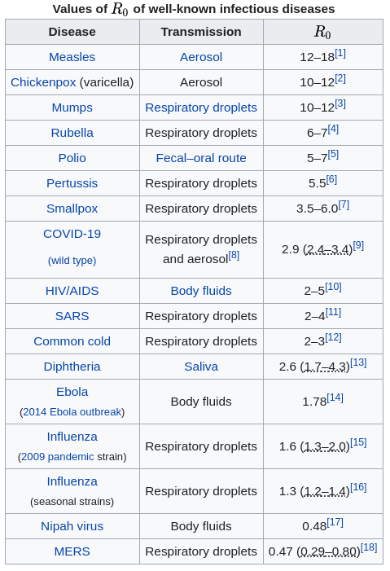
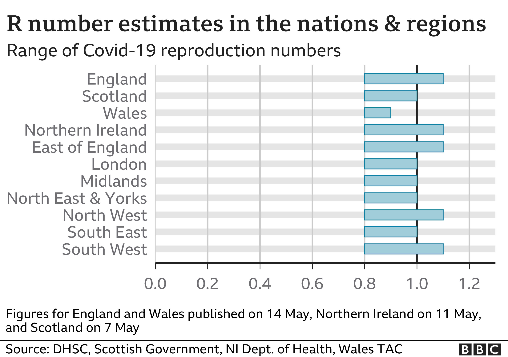

```{r,echo=FALSE,message=FALSE,warning=FALSE,error=FALSE}
knitr::opts_chunk$set(fig.path = "figure/", fig.lp = "fig.", fig.pos = "!htbp", fig.align = "center", echo = FALSE, warning = FALSE, error = FALSE, message = FALSE, out.width = "60%", fig.show = "hold", fig.asp = 0.6, results = "hide") # options set in this line doesn't apply to this code chunk
library(tidyverse)
theme_set(theme_bw(28))
theme_update(
#    legend.position = "none",
    strip.background = element_blank(),
	axis.title.y = element_text(angle=0, vjust = 0.5),
	axis.title.x = element_text(size = 25),
	legend.title = element_blank(),
	legend.text = element_text(size = 20),
	legend.position = "top"
)
library(magrittr)
```


# Outline
<!-- Thank you for coming to this taster lecture. My name is Clement, and I am a lecturer at the Mathematics and Statistics department at Lancaster University. If you can hear me and would like to interact, you can react to my message in the chat.

NEXT SLIDE

Today we will be talking about a hot topic - epidemics. You can understand them using what you have learned or will learn in A-Level Maths. I will start with talking about exponential growth, then move on to some simple epidemic models, before introducing the R number that everybody is talking about. Finally, we will relate this R number to the real-life work of scientists. While I am presenting, Josh, who will also be talking about his work, will post some links to the references I use. If you have any questions, feel free to type them in the chat.

NEXT SLIDE

You must have seen these graphs a lot these days. At the beginning of the lockdown, they talked about there is an exponential growth of number of cases, but what they were showing are curves that are close to straight lines. Can we explain why the curves are seemingly not showing exponential growth?

NEXT SLIDE

Some of you might have spotted the reason, and I will give a brief explanation. Let's look at a simple example, where $y$ is the number of cases and $t$ is time (in days). You can see $y$ is growing exponentially over $t$.

NEXT SLIDE

Now, we can rewrite the equation, by taking logarithm on both sides. I use the logarithm with base 10 here. You can see the log of $y$ increases linearly with $t$. If we put them on a plot, you will see a straight line.

NEXT SLIDE

One final touch is to change the vertical axis. If, for example, the log of $y$ is 4, then $y$ is equal 10 to the power 4. So we can change the labels on the vertical axis to powers of 10. This also means that, if you are going one unit up on the vertical axis, you are multiplying by the same amount, instead of adding by the same amount. Here, when t goes forward for 5 days, y is 10 times bigger, and when t goes forward for 10 days, y is 100 times bigger. If you think about how awful it would have been if the number of cases grew by 100 times in 10 days, you can see how powerful exponential growth is.

NEXT SLIDE

You might notice that this is not very realistic, because the equation means $y$ will go to infinity, but in reality neither the number of deaths nor the total number of cases could grow indefinitely. A better or more common way of describing epidemics or pandemics is through a certain kind of mathematical or statistical models for epidemics, and we will look at some simple versions of these models. We start with what we call a susceptible-infectious model, or an SI model. We write S as the number of people who have not been infected, and I as the number of people who are infected. We also assume that once they get infected, they will be infectious. The total population is denoted by N, and we assume it to be constant over the course of the epidemic.

NEXT SLIDE

The key principle of the model is that at any time, a person can only be susceptible or infectious, but not both at the same time. Another key component is the transition from susceptible to infectious. If there is no contact between a susceptible person and an infectious person, the susceptible person won't become infectious out of thin air. If there is contact, then the susceptible person might become infectious with a certain probability. To describe these dynamics in maths, we can use differential equations, which is something you might have come across with in your A-level maths. If not, don't worry, I will briefly explain these equations. We first assume beta is positive, and so all terms are positive. This means dS/dt is negative, or equivalently, S is decreasing over time. The rate that S decreases by, is proportional to the product of the number of susceptible and the number of infectious, divided by the total population. So when there's not many susceptible in the population, the magnitue of this rate is small. The same goes for when there's not many infectious in the population. That's why the epidemic starts off quite slowly at the beginning. Now, the number of infectious goes the opposite way to the number of susceptible and is increasing by the same rate, and that's why it is just dS/dt without the minus sign.

NEXT SLIDE

As I said, beta is assumed to be positive, and we will treat it as a parameter, and come back to it later. We can also see that dS/dt and dI/dt sum to 1. More importantly, recall that S and I sum to N, so we can do some rearranging and substitution, to express dI/dt in terms of beta, I and N only.

NEXT SLIDE

If you have learned a bit about differential equations, you can actually solve this differential equation! Therefore, I have turned it into a mock question. If you have a pen and a piece of paper, I will give you five minutes to give it a try. You will need part a's answer for part b. The five minutes start now!

PAUSE PAUSE

NEXT SLIDE

Right, let's come back and have a look at the solution. For part a, we let the fraction to be equal to A over N-I plus B over I. After making a common denominator for the two fractions and rearranging the terms, we have the second line. If we equate the coefficients, we have A-B=0 and B=1, which means A=1. This means the original fraction is equal to 1/(N-I) and 1/I.

NEXT SLIDE

For part b, you will notice that this is a variables separable question, which means we can move all the terms related to I to the left hand side. Integrating both sides with respect to t, we get the second line, and in the third line, we substitute in the answer to part a. The c on the right hand side is an unknown constant for now.

NEXT SLIDE

Now, integrating the left hand side gives us two terms involving the natural log. Using the property that log A minus log B is log A/B, we get the second line. Substitute the initial condition and we have the value of c.

NEXT SLIDE

Finally, we put c back into the equation, and rearrange terms again. ...

NEXT SLIDE

Now, I would like to investigate how I changes over time. As t becomes larger ...

NEXT SLIDE

Here is how it is looks like graphically. I used N equal 67.9 million, which is the population of the whole UK. You can see the number of infectious increases between day 100 and day 200, and the slope of the curve is greatest in the middle between these two ends, meaning that the rate of increase is the highest.

NEXT SLIDE

The SI model is probably the simplest model in epidemiology. It seems unrealistic to assume a person is only suspectible or infectious, because people can recover from the disease or there might be deaths, right? A more realistic model is the SIR model, in which there is this R state, where people are recovered or dead. For simplicity we combine these two groups of people, as both groups don't have any effect on the transmission anymore. This is however different to the R number ...

NEXT SLIDE

We have the differential equations again. dS/dt is the same as before, but there is an extra term in dI/dt, which is minus gamma I. This gamma represents how infectious people move to the recovered state, and therefore dR/dt is the same term without the minus. Observe that these three equations sum to zero, which makes sense because S+I+R is N, and so the sum of the rates become dN/dt. As N is assumed to be the constant population, dN/dt is 0.

NEXT SLIDE

If you study maths and statistics in university, you will learn how to solve them, ...

NEXT SLIDE

I promised at the beginning that I will talk about the R number. Here, I call it R naught because that's the proper term that scientists use. To calculate R0, we need the two parameters beta and gamma in the SIR model, which represent ...

NEXT SLIDE

Another way of looking at R0 is by rearranging the equation for dI/dt ...

NEXT SLIDE

It seems like the R0 is constant, but the government is saying it is going down. Which is right? In fact, this R0 changes over time and space .....

We can't quite control the biology of the virus itself, once it's already spread among the population, so we control how frequently we make contacts with other people. And that's why social distancing lowers the second factor and pushes the R number down.

NEXT SLIDE

Another thing that can be partially explained by R0 is that more deadly diseases doesn't necessarily lead to bigger epidemics or pandemics. Shown here is the table of R0. ...

This means the death rate doesn't represent everything, but neither does the R number. Scientists look at all kinds of numbers to compare between diseases.

NEXT SLIDE

Speaking of the scientists, you may wonder what are they doing? When I say scientists, I am not only talking about people who work in the scientific or medical departments in the government. In universities, teaching is done by lecturers like me and sometimes PhD students. But at the same time, we also carry out research on science or in our specialised disciplines. Josh and Chris who will talk in a bit, they are the scientists in this university who are researching on coronavirus right now. Some scientists carry out clinical trials, while some others calculate the parameters and R0 based on the data, and that brings about the need of collecting the data, which is not that straightforward. The scientists will also apply models that are more realistic than SI and SIR models.

NEXT SLIDE

Coming back to the SIR model, if we know all the numbers and parameters beforehand, we can make calculations easily, and get a very nice graph, like the one you are looking at.

NEXT SLIDE

In reality, this is not the case. The parameters are unknown, and the population is varying and divided into different regions. To make calculations more difficult, there are random fluctuations in the data due to various reasons, and that's why you see that the curves are not as smooth as in the previous graph.

NEXT SLIDE

The random fluctuations also lead to the uncertainty with the parameters we calculated, and that's why you hear from the scientific advisers that R0 is between 0.7 and 0.9, instead of saying it is precisely 0.8. If you study maths and stats in university, you will learn about the methods of calculating these numbers and quantifying the uncertainty around them. To me it feels like doing some reverse engineering using the data, which can be quite fun.

NEXT SLIDE

On that note, I would like to thank you for listening. Josh will be posting the links to some useful resources, and will also talk about his current work on coronavirus. Before that, does anybody have any questions?

-->

- Exponential growth\itemsep=0.5em
- A simple epidemic model
- The R number (that everybody talks about)
- Connect to real-life work


# You might have seen this
```{r, results="asis", out.width = "70%"}
knitr::include_graphics("assets/FINAL_Press_Conference_Slides_20200330.pdf")
```
$\quad\quad$Source: [Government's slides to accompany coronavirus press conference](https://assets.publishing.service.gov.uk/government/uploads/system/uploads/attachment_data/file/876889/FINAL_Press_Conference_Slides_20200330.pdf)


# Exponential growth ...

```{r}
t <- seq(25) ####
A <- 0.5 ####
b <- 0.2 ####
y <- A * 10 ^ (b * t)
df0 <- tibble(y = y, t = t, logy = log10(y))
```

$$ y = `r A` \times 10^{`r b`t} %= `r A` \times e^{(`r b`\log_e10)t}$$

```{r}
up <- 5L ####
df0 %>% ggplot() +
	geom_point(aes(t, y), col = 2, size = 3) +
	geom_line(aes(t, y), col = 2, lwd = 1.2) +
	scale_y_continuous(
		breaks = c(0, seq(up) * 10000),
		labels = c(0, glue::glue("{seq(up)}0k")),
#		breaks = scales::trans_breaks("log10", function(x) 10^x),
#        labels = scales::trans_format("log10", scales::math_format(10^.x))
	) +
	labs(x = "t (days)")
```


# ... on a straight line

$$ \log_{10} y = \log_{10} `r A` + `r b` t $$

```{r}
df0 %>% ggplot() +
	geom_point(aes(t, logy), col = 2, size = 3) +
	geom_line(aes(t, logy), col = 2, lwd = 1.2) +
	labs(y = "log y", x = "t (days)")
```


# 10-fold every 5 days
$$ \log_{10} y = \log_{10} `r A` + `r b` t $$

```{r}
df0 %>% ggplot() +
	geom_point(aes(t, y), col = 2, size = 3) +
	geom_line(aes(t, y), col = 2, lwd = 1.2) +
	labs(y = "   y", x = "t (days)") +
	scale_y_log10(
		breaks = scales::trans_breaks("log10", function(x) 10^x),
        labels = scales::trans_format("log10", scales::math_format(10^.x))
	)
```


# An epidemic model

- Realistically, the number of cases/deaths can't go to infinity\itemsep=0.5em
- Susceptible-Infectious (SI) model
     - $S$: Number of people who have not been infected (susceptible)\itemsep=0.5em
    - $I$: Number of people who are infected and infectious
    - $N$: Total population, constant over time

$$S+I=N\qquad\qquad$$


# Dynamics of the SI model

- Susceptible or infectious at any time, but not both\itemsep=0.5em
- Transition from $S$ to $I$
    * No contact, no infection\itemsep=0.5em
    * Contact with an infectious person - might or might not become infectious
- How do we describe the dynamics? Differential equations!

$$ \frac{dS}{dt} = -\beta\frac{S\times I}{N} $$
$$ \frac{dI}{dt} = \beta\frac{S\times I}{N} $$


# Understanding the equations

- $\beta>0$ is an unknown **parameter**\itemsep=0.5em
- $\displaystyle\frac{dS}{dt} + \frac{dI}{dt} = 0$
- Also, remember $S+I=N$, so

$$ \frac{dI}{dt} = \beta \frac{S\times I}{N}\qquad\qquad $$
$$ = \beta\frac{(N-I)\times I}{N}~ $$


# Mock question!
**A-Level**  
**MATHEMATICS**  
**Paper 1**  

Question 1

a. Decompose the function $\displaystyle\frac{N}{(N-I)\times I}$ into partial fractions. [2 marks]\itemsep=0.5em
b. Given that $I=1$ at $t=0$, solve the following differential equation. [5 marks]

$$ \frac{dI}{dt} = \beta \frac{(N-I)\times I}{N} $$


# Question 1a
Let
$$ \displaystyle\frac{N}{(N-I)\times I}=\frac{A}{N-I}+\frac{B}{I} $$
Rearranging terms, we have
$$ \frac{N}{(N-I)\times I}=\frac{(A-B)\times{}I+BN}{(N-I)\times{}I} $$
Equating the coefficients, we have $A-B=0$ and $B=1$, which means $A=1$.
$$ \therefore \frac{N}{(N-I)\times I}=\frac{1}{N-I}+\frac{1}{I} $$


# Question 1b
As this is a "variables separable" question, we have
$$ \frac{N}{(N-I)\times I}\frac{dI}{dt}=\beta $$
Integrating both sides with respect to $t$
$$ \int\frac{N}{(N-I)\times I}dI = \int\beta dt $$
Using result in Question 1a,
$$ \int\left(\frac{1}{N-I}+\frac{1}{I}\right)dI = \beta{}t + c, $$
where $c$ is a constant.


# Question 1b (cont'd)
$$ -\log_e(N-I)+\log_e{}I=\beta{}t+c $$
As $\displaystyle\log_e\frac{A}{B} = \log_e A - \log_e B = -\log_e B + \log_e A$,
$$ \log_e\frac{I}{N-I}=\beta{}t + c $$
Substitute the initial condition $I=1$ when $t=0$,
$$ \log_e\frac{1}{N-1} = c $$


# Question 1b (cont'd)
$$ \log_e\frac{I}{N-I}=\beta{}t+\log_e\frac{1}{N-1} $$
Exponentiating and reciprocating both sides,
$$ \frac{N-I}{I}=(N-1)e^{-\beta{}t} $$
Adding one to both sides and rearranging,
$$ I = \frac{N}{1 + (N-1)e^{-\beta{}t}} $$


# Intepretation
$$ I = \frac{N}{1 + (N-1)e^{-\beta{}t}} $$
As $t$ becomes larger:

- $e^{-\beta{}t}$ becomes smaller\itemsep=0.5em
- The denominator becomes smaller
- $I$ becomes larger


# An example
<!-- If you look at the first part, up to $t=250$, it looks like an exponential curve -->
```{r}
N <- 6.79e+7 ####
beta <- 0.114 ####
T <- 500 ####
t <- 0:T ####
ticks <- 0:7 ####
vals <- c("Infectious" = "2", "Susceptible" = "4", "Removed" = "7") ####
plot_epi <- function(df) {
    o <- floor(log10(max(df$value)))
	df %>% ggplot() +
	   geom_line(aes(t, value, col = key), lwd = 1.2) +
	   scale_colour_manual(values = vals) +
	   labs(y = NULL, x = "t (days)") +
	   scale_y_continuous(breaks = ticks*10^o, labels = glue::glue("{ticks*10}m"))
}
```

$N=`r N/1e+6`$ million, $\beta=`r beta`$

```{r}
df1 <- tibble(
	t = t,
    Infectious = N/(1.0+(N-1.0)/exp(beta*t)),
	Susceptible = N-Infectious) %>%
	gather(key, value, Susceptible, Infectious) %>%
	mutate(key = as_factor(key))
plot_epi(df1)
```


# A better model

SIR model

- $R$: People who are **removed** (recovered or death)\itemsep=0.5em
    * Different to the **R number** the government has been talking about
	* We will come to this R number later
- $S$, $I$, $N$: as before

$$ S+I+R=N\qquad\qquad $$


# Differential equations again
$$ \frac{dS}{dt} = -\beta\frac{S\times{}I}{N} $$
$$ \qquad\frac{dI}{dt} = \beta\frac{S\times{}I}{N} - \gamma{}I ~$$
$$ \frac{dR}{dt} = \gamma{}I \qquad\quad$$

Observe that
$$ ~~~\frac{dS}{dt} + \frac{dI}{dt} + \frac{dR}{dt} = \frac{dN}{dt} = 0 \qquad\qquad\qquad$$


# Another mock question?

- Too difficult to solve it in 5 minutes\itemsep=0.5em
    * You'll learn how to solve these equations
- In some more sophisticated models
    * Impossible to solve the equations using pen and paper
	* You'll learn numerical methods if a "nice" solution is not available
- Want to know more? See the [SI, SIR & other models on Wikipedia](https://en.wikipedia.org/wiki/Compartmental_models_in_epidemiology)


# The R$_0$ number

- Two parameters, $\beta$ and $\gamma$ in the SIR model\itemsep=0.5em
    * $\beta$: The rate of infection
	* $\gamma$: The rate of removal (recovery or death)
- The R$_0$ number is equal to $\beta/\gamma$
- If $\beta<\gamma$, R$_0<1$
    * Removals faster than new infections
	* Epidemic under control
- If $\beta>\gamma$, R$_0>1$
    * New infections faster than removals
	* Epidemic bound to happen
<!-- This is why the scientific advisers keep emphasising that it is important to keep this number below 1, because we won't be able to control the epidemic if it gets above 1. -->


# Another way of looking at R$_0$
$$ \frac{dI}{dt} = \beta\frac{S\times{}I}{N}-\gamma{}I\qquad\quad~ $$
$$ = \frac{\beta}{\gamma}\times\frac{S\times\gamma{}I}{N}-\gamma{}I $$
$$ = \left(\text{R}_0\frac{S}{N}-1\right)\times\gamma{}I $$
At $t=0$, $S$ is close to $N$, so
$$\displaystyle\frac{dI}{dt}\approx(\text{R}_0-1)\times\gamma{}I\quad\qquad~$$
If R$_0>1$, $\displaystyle\frac{dI}{dt}>0~\Rightarrow~$ increasing number of infectious


# R$_0$ changes over time and space

- It seems like the R$_0$ number is constant\itemsep=0.5em
- But $\beta$ (infection rate) and R$_0$ depend on some factors:
    * The biological nature of the virus
	* How many contacts do we make
- Social distancing and other measures:
    * lower the 2$^{\text{nd}}$ factor
	* push $\beta$ & R$_0$ down


# More deadly $=$ bigger pandemic?

:::::: {.columns}
::: {.column width="50%" data-latex="{0.50\textwidth}"}
${}$  

- Ebola has a higher death rate\itemsep=0.5em
    * $\gamma$ is higher
- R$_0=\beta/\gamma$
    * If $\beta$ stays the same
    * A higher $\gamma$ pushes R$_0$ down
- Deadlier diseases/viruses not necessarily more widespread
- One single number doesn't tell the whole story
- Source: [R$_0$ number on Wikipedia](https://en.wikipedia.org/wiki/Basic_reproduction_number) \itemsep=0.5em
:::

::: {.column width="50%" data-latex="{0.50\textwidth}"}
```{r, fig.show="asis", results = "asis", out.width = "55%", fig.align="left"}
 
```
:::
::::::


# What are the scientists (= we) doing?

- Calculate the parameters and R$_0$ number\itemsep=0.5em
- Collect the data of the numbers of infectious, deaths and recovery
- Apply more realistic models
    * The SI and SIR models are too simplistic
	* If the model is no good, the results are no good


# If we know the numbers
```{r}
## N, T, t & beta previous defined
NAT <- rep(as.double(NA), T)
R0 <- 5.7 ####
gamma <- beta / R0
```

- $N=`r N/1e+6`$ million  
- $\beta=`r beta`$, $\gamma=`r gamma`$ $\Rightarrow$ R$_0=`r R0`$

```{r}
S <- c(N-1.0, NAT)
I <- c(1.0, NAT)
R <- c(0.0, NAT)
for (i in seq(T)) {
	a <- beta * S[i] * I[i] / N
	b <- gamma * I[i]
	S[i+1] <- S[i] - a
	I[i+1] <- I[i] + a - b
	R[i+1] <- R[i] + b
}
df2 <- tibble(t = t, Susceptible = S, Infectious = I, Removed = R) %>%
	gather(key, value, Susceptible, Infectious, Removed) %>%
	mutate(key = as_factor(key))
plot_epi(df2)
```


# Reality

- Population varying & divided into regions  
- $\beta=\underline{\textcolor{white}{`r beta`}}$,
$\gamma=\underline{\textcolor{white}{`r gamma`}}$
$\Rightarrow$ R$_0=\underline{\textcolor{white}{`r R0`}}$
```{r}
thin <- 1e+5 #### too long for large population
N0 <- N / thin
t_vec <- t <- 0.0
S_vec <- S <- N0-1L
I_vec <- I <- 1L
R_vec <- R <- 0L
count <- 0L
set.seed(12342)
while (S > 0 && I > 0 && R < N0 && t < T && count < 1e+8) {
    count <- count + 1L
	a <- beta * S * I / N0
	b <- gamma * I
    h <- rexp(1, a + b)
	if (runif(1) < a / (a + b)) {
	    S <- S - 1L
		I <- I + 1L
    } else {
	    I <- I - 1L
		R <- R + 1L
	}
	t_vec <- c(t_vec, h)
	S_vec <- c(S_vec, S)
	I_vec <- c(I_vec, I)
	R_vec <- c(R_vec, R)
}
df3 <- tibble(t = cumsum(t_vec), Susceptible = S_vec, Infectious = I_vec, Removed = R_vec) %>%
	gather(key, value, Susceptible, Infectious, Removed) %>%
	mutate(key = as_factor(key))
plot_epi(df3)
```


# Uncertainty
<!-- If you study mathematics and statistics in university, you will learn about the methods of reverse engineering, calculating these numbers, and quantifying the uncertainty around these numbers-->
```{r, results="asis", out.width = "50%"}
#, fig.show="asis", results = "asis", out.width = "55%", fig.align="left"}
 
```
$\qquad\qquad\qquad\qquad\qquad$Source: [BBC's coronavirus UK map](https://www.bbc.co.uk/news/uk-51768274)


# Thanks for listening!
Useful resources:

- [Government's press conference slides](https://www.gov.uk/government/collections/slides-and-datasets-to-accompany-coronavirus-press-conferences)\itemsep=0.5em
- [Government's data archive](https://coronavirus.data.gov.uk/archive)


<!-- Network effect & another kind of spreading -->

<!-- If unbalanced network, then spread more easily -->
<!-- If balanced network, some time it might not happen -->
<!-- If Billie Eilish retweets a photo on social media, it will likely create an "epidemic" -->
<!-- If I retweet a photo, no epidemic -->

